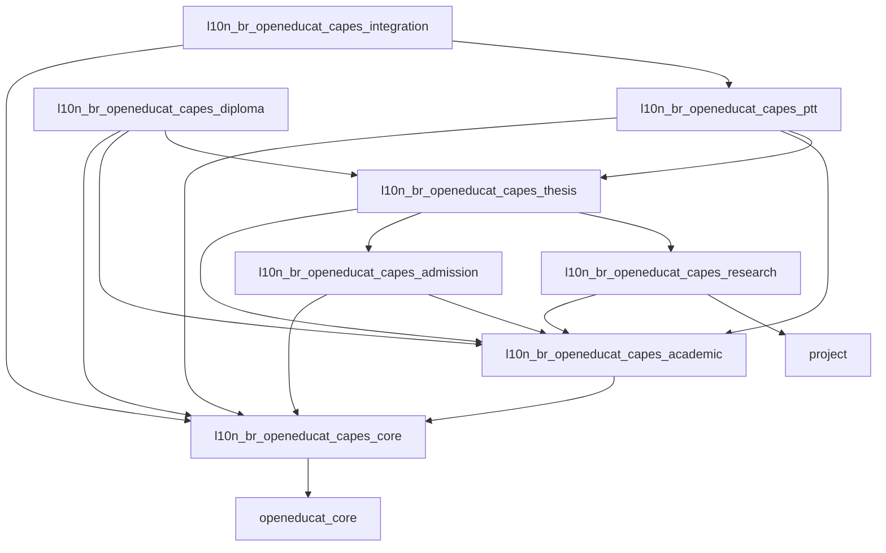
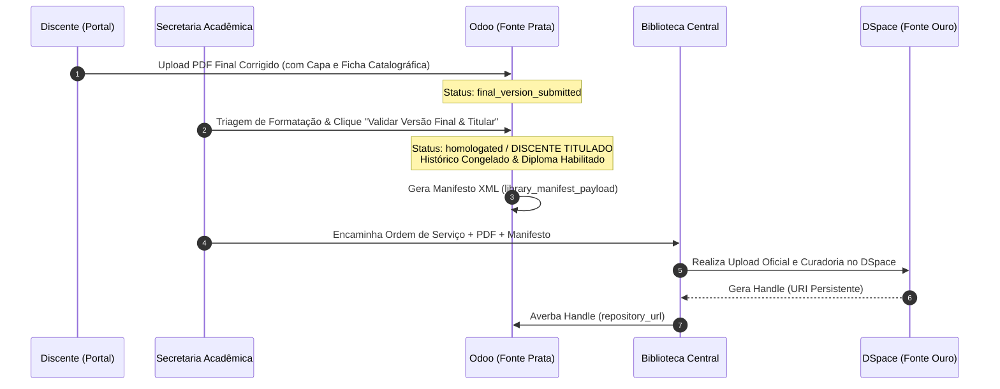

# Ecossistema `l10n_br_openeducat_capes`
### Módulos de Localização Brasileira do OpenEduCat para Pós-Graduação *Stricto Sensu* (Odoo 19.0)

[](https://www.odoo.com/)
[](https://openeducat.org/)
[](https://www.gov.br/capes/)
[-orange.svg)](https://www.in.gov.br/)
[](LICENSE)
[](https://www.docker.com/)

O **`l10n_br_openeducat_capes`** é uma suíte completa de módulos de localização brasileira para o **Odoo 19.0** e **OpenEduCat 19.0**, projetada para qualquer Programa de Pós-Graduação *Stricto Sensu* (Mestrado Acadêmico, Mestrado Profissional e Doutorado) de Instituições de Ensino Superior (IES) e Institutos de Pesquisa no Brasil.

O ecossistema atende integralmente às diretrizes do **Programa GoPG da CAPES (Portaria nº 158/2023)**, à **Instrução Normativa nº 1/2026 (RICA|PG)**, ao **Qualis Tecnológico (Diretrizes GTPT)** e às exigências de **Diplomas Digitais Nato-Digitais (Portaria MEC nº 70/2025)** sob o paradigma do **Ato Jurídico Perfeito (CF/88)**.

---

## 🏛️ Topologia do Monorepo (8 Submódulos)

O monorepo está estruturado sob os princípios de *Domain-Driven Design* (DDD) em 8 submódulos desacoplados com dependências estritas:

```text
l10n_br_openeducat_capes/
├── l10n_br_openeducat_capes_core         # PIDs biográficos (ORCiD, Lattes, CPF), IES, PPGs (Código SNPG)
├── l10n_br_openeducat_capes_admission    # Editais de Seleção, Cotas, Fases Dinâmicas e Conversão em Aluno
├── l10n_br_openeducat_capes_academic     # Versionamento Regimental (op.curriculum.version) e Livro-Razão (append-only)
├── l10n_br_openeducat_capes_research     # Projetos de Pesquisa, Linhas de Pesquisa e Taxonomia CRediT
├── l10n_br_openeducat_capes_thesis       # Ritos Bipartidos (Seminários/Qualificação/Defesa), Bancas e Versão Final PDF
├── l10n_br_openeducat_capes_ptt          # Produtos Técnico-Tecnológicos, 4 Eixos, 21 Tipos, TRL 1-9 e Qualis Tecnológico
├── l10n_br_openeducat_capes_integration  # Barramento REST JSON v1 (Fonte Prata) e Crosswalk DSpace OAI-PMH (Fonte Ouro)
└── l10n_br_openeducat_capes_diploma      # Histórico Consolidado QWeb, Diploma Nato-Digital (MEC 70/2025) e XAdES
```

### Árvore de Dependências entre Submódulos



---

## 🐳 Execução via Docker e Docker Compose

O ecossistema dispõe de ambiente Docker conteinerizado pré-configurado com **Odoo 19.0** e **PostgreSQL 16** (com extensões `unaccent` e `pg_trgm`).

### 1. Pré-requisitos
- Docker Engine $\ge 24.0$
- Docker Compose Plugin $\ge 2.20$
- Git

### 2. Baixar Dependências do OpenEduCat
Antes de iniciar os contêineres, execute o script para baixar e preparar a dependência `openeducat_core` na pasta `external_addons/`:

```bash
./scripts/fetch_dependencies.sh
```

### 3. Configurar Variáveis de Ambiente
Copie o arquivo de exemplo `.env.example` para `.env` e ajuste as senhas e portas conforme necessário:

```bash
cp .env.example .env
```

### 4. Iniciar o Ambiente Docker
Para construir a imagem customizada do Odoo 19 e subir o stack de serviços:

```bash
docker compose up -d --build
```

### 5. Acessar a Aplicação
- **URL do Odoo:** [http://localhost:8069](http://localhost:8069)
- **Master Password (para criar o Banco de Dados):** Definição constante no arquivo `.env` (`ODOO_ADMIN_PASSWD`).

Ao criar a base de dados (ex: `ppg_exemplo_db`), acesse a tela de **Aplicativos**, remova o filtro "Aplicativos" da barra de busca e instale os submódulos na ordem:
1. `l10n_br_openeducat_capes_core`
2. `l10n_br_openeducat_capes_admission`
3. `l10n_br_openeducat_capes_academic`
4. `l10n_br_openeducat_capes_research`
5. `l10n_br_openeducat_capes_thesis`
6. `l10n_br_openeducat_capes_ptt`
7. `l10n_br_openeducat_capes_integration`
8. `l10n_br_openeducat_capes_diploma`

---

## 🌐 Transição para IP Externo / Servidor de Produção

Para disponibilizar o sistema em um IP externo ou rede local (ex: `192.168.x.x` ou domínio oficial):

1. Edite o arquivo `.env`:
   ```bash
   # Altere a ligação de 127.0.0.1 para 0.0.0.0
   BIND_HOST=0.0.0.0
   ```
2. Reinicie o ambiente:
   ```bash
   docker compose restart
   ```

---

## 🔄 Fluxos Chave de Arquitetura e Regras de Negócio

### 1. Depósito da Versão Final & Titulação (Fluxo Institucional / Biblioteca)
Em alinhamento com as melhores práticas institucionais, o discente efetua o depósito da versão final da dissertação/tese no Portal Odoo.



### 2. Versionamento Regimental Dinâmico (`op.curriculum.version`)
- Todas as regras de quórum de bancas, prazos limite, prorrogações, proficiência em idiomas e fatores de conversão de créditos (disciplinas, exames, trabalhos de conclusão, atividades complementares) são 100% parametrizáveis por programa e regimento.
- Sem *hardcode* no código Python.

### 3. Imutabilidade do Livro-Razão (`op.student.credit.ledger`)
- Tabelas operadas estritamente em modo *append-only*.
- Impedimento absoluto de recálculos destrutivos ou exclusão de créditos já consolidados no histórico escolar.

### 4. Qualis Tecnológico PTT (`capes.ptt.product`)
- Taxonomia oficial de **4 Eixos Estruturantes** e **21 Tipologias** do GTPT / CAPES.
- Avaliação multidimensional em escala **TRL 1-9** com calculadora automatizada de estratos (**T1 a T5**).

### 5. Gestão de Diplomas, Livros de Registro e Titulação (MEC 70/2025 & Físico em Papel)
- Governança parametrizável para Universidades Autônomas e para Institutos de Pesquisa (como o **IPEN-CNEN/SP**), cujos diplomas são remetidos para escrituração na IES Registradora Externa (**USP**).
- Suporte híbrido a Diplomas Físicos em Papel (com protocolo de remessa, Livro de Registro e Folha) e Diplomas Nato-Digitais em XML/XAdES (Portaria MEC nº 70/2025).

---

## 📊 Perfil de Referência e Validação Regulatória

Como validação empírica e prova de conceito regulatória, o sistema foi parametrizado e validado contra o perfil do **Mestrado Profissional em Tecnologia das Radiações em Saúde (MP-TRCS)** do **IPEN-CNEN/SP** (com registro de diplomas na **USP**):
- As regras específicas e listas de verificação desse perfil encontram-se documentadas no diretório [`docs/09_validacoes_mptrcs/`](docs/09_validacoes_mptrcs).
- Modelos de dados e planilhas de importação de exemplo estão disponíveis em [`import_templates/exemplos_referencia/mptrcs_ipen/`](import_templates/exemplos_referencia/mptrcs_ipen).

---

## 📚 Documentação Técnica Completa (`docs/`)

O repositório conta com uma infraestrutura documental completa no diretório [`docs/`](docs):

- **[01_arquitetura_sistemica](docs/01_arquitetura_sistemica):** Visão Geral do GoPG, Fonte Ouro/Prata e Topologia do Monorepo.
- **[02_governanca_regimental_e_creditos](docs/02_governanca_regimental_e_creditos):** Motor de Versionamento Curricular e Livro-Razão Imutável.
- **[03_dicionarios__de_dados_dav](docs/03_dicionarios__de_dados_dav):** Especificação dos Dicionários de Dados da DAV Módulos 01 a 06.
- **[04_processos_da_vida_academica](docs/04_processos_da_vida_academica):** Editais de Admissão, Matrículas de Acompanhamento e Trava de Prazos.
- **[05_produtos_tecnico_tecnologicos_ptt](docs/05_produtos_tecnico_tecnologicos_ptt):** Taxonomia GTPT, Qualis Tecnológico e Motor de Estratificação.
- **[06_titulacao_e_conformidade_documental](docs/06_titulacao_e_conformidade_documental):** Rito Bipartido, Histórico Consolidado e Diploma Digital MEC 70/2025.
- **[07_padroes_de_interoperabilidade_externa](docs/07_padroes_de_interoperabilidade_externa):** APIs RESTful Fonte Prata e Crosswalk XSLT DSpace (`oai_capes`).
- **[08_macroprocessos](docs/08_macroprocessos):** Mapeamento dos 10 Macroprocessos Acadêmicos de Ponta a Ponta.
- **[09_validacoes_mptrcs](docs/09_validacoes_mptrcs):** Perfil de Referência e Checklists de Validação MP-TRCS IPEN-CNEN/SP.
- **[Guia de Migração e Transição do Sistema Legado](docs/guia_de_migracao_e_transicao_legacy.md):** Manual detalhado para zerar bases de teste e migrar dados do sistema antigo.
- **[Templates CSV Universais e Exemplos](import_templates):** Planilhas pré-formatadas genéricas para importação nativa e exemplos de referência.
- **Relatório Executivo HTML Autocontido:** [docs/documentacao_executiva_capes.html](docs/documentacao_executiva_capes.html)

---

## 🛠️ Comandos Úteis

```bash
# Baixar dependências do OpenEduCat
./scripts/fetch_dependencies.sh

# Subir ambiente Docker
docker compose up -d --build

# Acompanhar logs do Odoo
docker compose logs -f odoo

# Parar contêineres
docker compose down
```

---

## 🤝 Governança e Contribuição

Contribuições da comunidade acadêmica, desenvolvedores Odoo e gestores de PPGs são extremamente bem-vindas!
- Consulte nosso [Guia de Contribuição (`CONTRIBUTING.md`)](CONTRIBUTING.md) para entender os padrões de código, regras de arquitetura e fluxo de Pull/Merge Requests.
- Respeite o nosso [Código de Conduta (`CODE_OF_CONDUCT.md`)](CODE_OF_CONDUCT.md).

---

## 📄 Licença

Este projeto é um software livre distribuído sob os termos da licença **GNU Lesser General Public License v3.0 (LGPL-3.0)**. Consulte o arquivo [`LICENSE`](LICENSE) para mais detalhes.
