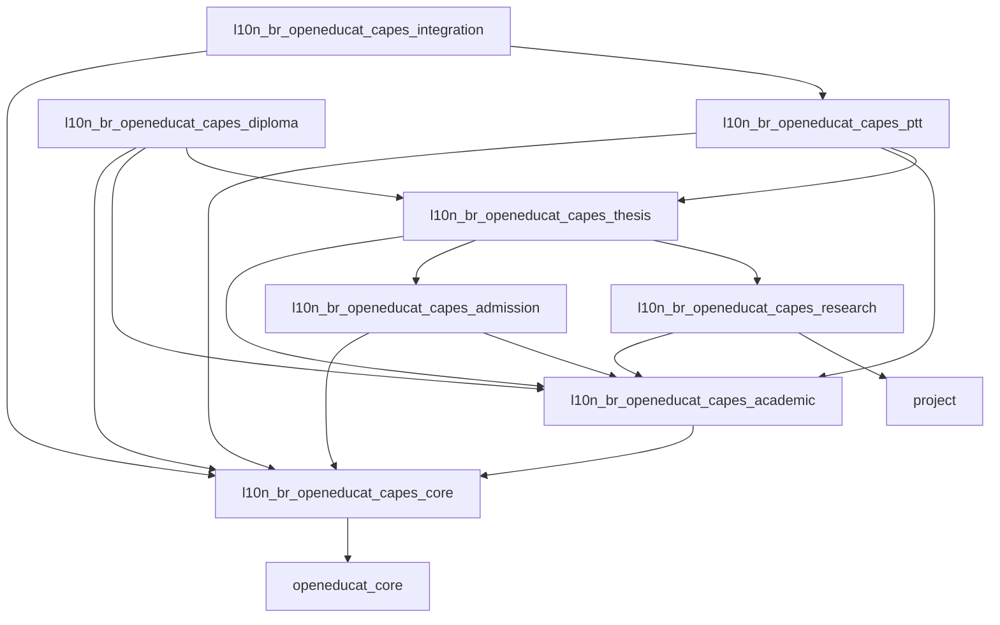
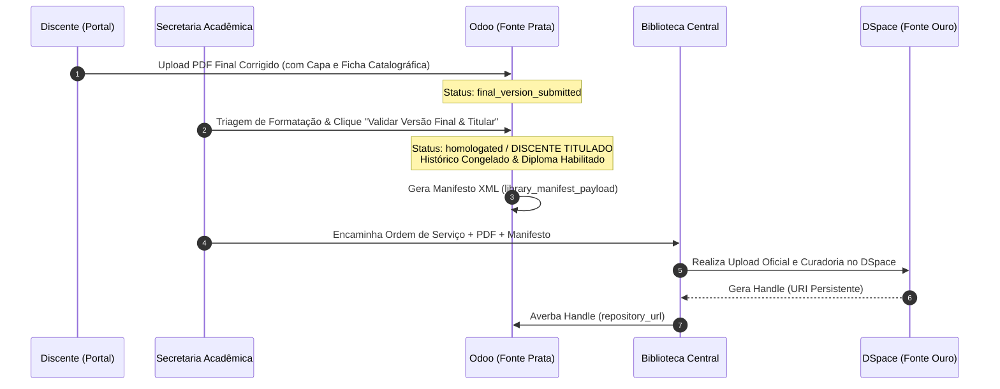

# Ecossistema `l10n_br_openeducat_capes`
### Módulos de Localização Brasileira do OpenEduCat para Pós-Graduação *Stricto Sensu* (Odoo 19.0)

[](https://www.odoo.com/)
[](https://openeducat.org/)
[](https://www.gov.br/capes/)
[-orange.svg)](https://www.in.gov.br/)
[](LICENSE)
[](https://www.docker.com/)

O **`l10n_br_openeducat_capes`** é uma suíte completa de módulos de localização brasileira para o **Odoo 19.0** e **OpenEduCat 19.0**, projetada para qualquer Programa de Pós-Graduação *Stricto Sensu* (Mestrado Acadêmico, Mestrado Profissional e Doutorado) de Instituições de Ensino Superior (IES) e Institutos de Pesquisa no Brasil.

O ecossistema atende integralmente às diretrizes do **Programa GoPG da CAPES (Portaria nº 158/2023)**, à **Instrução Normativa nº 1/2026 (RICA|PG)**, ao **Qualis Tecnológico (Diretrizes GTPT)** e às exigências de **Diplomas Digitais Nato-Digitais (Portaria MEC nº 70/2025)** sob o paradigma do **Ato Jurídico Perfeito (CF/88)**.

---

## 🏛️ Topologia do Monorepo (8 Submódulos)

O monorepo está estruturado sob os princípios de *Domain-Driven Design* (DDD) em 8 submódulos desacoplados com dependências estritas:

```text
l10n_br_openeducat_capes/
├── l10n_br_openeducat_capes_core         # Identidade Soberana Discente (RA perene), PIDs biográficos (ORCiD, Lattes, CPF), IES, PPGs (Código SNPG)
├── l10n_br_openeducat_capes_admission    # Editais de Seleção, Cotas, Fases Dinâmicas e Conversão em Aluno com Preservação de RA
├── l10n_br_openeducat_capes_academic     # Versionamento Regimental (op.curriculum.version), Multi-Vínculo, Aluno Especial, Trânsito Intra-IES e Livro-Razão (append-only)
├── l10n_br_openeducat_capes_research     # Projetos de Pesquisa, Linhas de Pesquisa e Taxonomia CRediT
├── l10n_br_openeducat_capes_thesis       # Ritos Bipartidos (Seminários/Qualificação/Defesa), Bancas e Versão Final PDF
├── l10n_br_openeducat_capes_ptt          # Produtos Técnico-Tecnológicos, 4 Eixos, 21 Tipos, TRL 1-9 e Qualis Tecnológico
├── l10n_br_openeducat_capes_integration  # Barramento REST JSON v1 (Fonte Prata) e Crosswalk DSpace OAI-PMH (Fonte Ouro)
└── l10n_br_openeducat_capes_diploma      # Histórico Consolidado QWeb, Diploma Nato-Digital (MEC 70/2025) e Registro Externo (IPEN -> USP)
```

### Árvore de Dependências entre Submódulos



---

## 🐳 Execução via Docker e Docker Compose

O ecossistema dispõe de ambiente Docker conteinerizado pré-configurado com **Odoo 19.0** e **PostgreSQL 16** (com extensões `unaccent` e `pg_trgm`).

### 1. Pré-requisitos
- Docker Engine $\ge 24.0$
- Docker Compose Plugin $\ge 2.20$
- Git

### 2. Baixar Dependências do OpenEduCat
Antes de iniciar os contêineres, execute o script para baixar e preparar a dependência `openeducat_core` na pasta `external_addons/`:

```bash
./scripts/fetch_dependencies.sh
```

### 3. Configurar Variáveis de Ambiente
Copie o arquivo de exemplo `.env.example` para `.env` e ajuste as senhas e portas conforme necessário:

```bash
cp .env.example .env
```

### 4. Iniciar o Ambiente Docker
Para construir a imagem customizada do Odoo 19 e subir o stack de serviços:

```bash
docker compose up -d --build
```

### 5. Acessar a Aplicação
- **URL do Odoo:** [http://localhost:8069](http://localhost:8069)
- **Master Password (para criar o Banco de Dados):** Definição constante no arquivo `.env` (`ODOO_ADMIN_PASSWD`).

Ao criar a base de dados (ex: `ppg_exemplo_db`), acesse a tela de **Aplicativos**, remova o filtro "Aplicativos" da barra de busca e instale os submódulos na ordem:
1. `l10n_br_openeducat_capes_core`
2. `l10n_br_openeducat_capes_admission`
3. `l10n_br_openeducat_capes_academic`
4. `l10n_br_openeducat_capes_research`
5. `l10n_br_openeducat_capes_thesis`
6. `l10n_br_openeducat_capes_ptt`
7. `l10n_br_openeducat_capes_integration`
8. `l10n_br_openeducat_capes_diploma`

### 6. Perfis de Usuário Pré-Configurados para Testes

Para testar o cotidiano dos diferentes atores do Programa de Pós-Graduação no cenário de referência:

| Login | Perfil / Papel | Senha de Teste | Atribuições Principais |
| --- | --- | --- | --- |
| `admin` | Administrador de TI / Sistema | `admin` | Gestão de parâmetros globais, base de dados e módulos Odoo. |
| `secretaria` | Secretaria Acadêmica | `secretaria123` | Matrículas, cadastros discentes, livro-razão, históricos e diplomas. |
| `coordenador` | Coordenador do Programa | `coordenador123` | Presidência da CPG, homologação de bancas, acompanhamento de prazos. |
| `vicecoordenador` | Vice-Coordenador do Programa | `vicecoordenador123` | Apoio à coordenação e substituição em deliberações colegiadas. |
| `professor` | Docente e Orientador | `professor123` | Diário de classe, notas, planos de trabalho e pareceres de orientandos. |

---

## 🌐 Transição para IP Externo / Servidor de Produção

Para disponibilizar o sistema em um IP externo ou rede local (ex: `192.168.x.x` ou domínio oficial):

1. Edite o arquivo `.env`:
   ```bash
   # Altere a ligação de 127.0.0.1 para 0.0.0.0
   BIND_HOST=0.0.0.0
   ```
2. Reinicie o ambiente:
   ```bash
   docker compose restart
   ```

---

## 🔄 Fluxos Chave de Arquitetura e Regras de Negócio

### 1. Identidade Soberana Discente & Arquitetura Multi-Vínculo (Opção B)
- **Cadastro Perene na Mantenedora (`op.student`):** Cada discente possui um Registro Acadêmico (RA) único e vitalício gerado por sequência automática, indexado ao seu CPF e à empresa mantenedora (`company_id`). Uma restrição Python impede duplicidade discente na mesma IES.
- **Desacoplamento de Vínculos de Curso (`op.student.course`):** O aluno pode transitar por múltiplos regimes ao longo de sua trajetória (Aluno Especial, Mestrado Regular, Doutorado Regular) sem duplicar seu cadastro pessoal nem seu RA.
- **Conversão com Preservação de Identidade:** Na admissão regular (`op.admission.edital`), o sistema detecta se o candidato aprovado já possui cadastro discente na IES (por exemplo, como ex-aluno especial), reutiliza o registro existente, preserva o RA soberano e apenas instancia o novo vínculo de curso regular.

### 2. Ciclo de Vida do Aluno Especial, Quarentena e Decadência de 36 Meses
- **Quarentena de Créditos (`subject_special_quarantine`):** Disciplinas cursadas no regime especial são lançadas no Livro-Razão imutável sob uma taxonomia de quarentena. Elas **não pontuam** para integralização de programas regulares nem geram direitos automáticos de titulação.
- **Decadência Prescricional de 36 Meses (3 Anos):** Em alinhamento com a legislação educacional, os créditos especiais possuem validade máxima de 3 anos para aproveitamento.
- **Incorporação Formal via CPG (`op.special.credit.incorporation.request`):** Ao ingressar como regular, o discente submete requerimento de aproveitamento que passa por parecer de mérito do orientador e homologação da CPG. Aprovado, gera lançamentos *append-only* convalidadores do tipo `subject_special_incorporated`.
- **Histórico Oficial Limpo (`omit_on_regular`):** Na emissão do histórico escolar oficial de conclusão do aluno regular, as disciplinas de regime especial mantidas em quarentena (não incorporadas) e eventuais reprovações daquele período são omitidas, garantindo fé pública e conformidade documental.

### 3. Trânsito Acadêmico Intra-IES vs Extra-IES (Diferenciação Regulatória IPEN/USP)
- **Trânsito Intra-IES (`subject_intra_ies`):** Discentes regulares podem cursar disciplinas oferecidas por outros programas de pós-graduação da mesma IES mantenedora (`company_id`). Os créditos são integralizados a **100% de seu valor nominal original**, regulados por teto percentual definido no regimento curricular (`max_intra_ies_credits_percent`).
- **Diferenciação Regulatória do Caso IPEN / USP:**
  * O **MPTRCS** é um programa de pós-graduação exclusivo do **IPEN** (IES = IPEN-CNEN/SP).
  * O outro programa de pós-graduação em funcionamento nas instalações do IPEN (**Tecnologia Nuclear**) é formalmente vinculado à **Universidade de São Paulo (USP)** (IES = USP).
  * Consequentemente, para os alunos do MPTRCS, o programa de Tecnologia Nuclear da USP constitui juridicamente **outra IES (Extra-IES)**. Seus créditos entram como `subject_extra_ies`, exigindo parecer e autorização da CPG e computando contra o teto regimental de créditos externos (Art. 31º §1º - máximo de 20 créditos).

### 4. Versionamento Regimental Dinâmico (`op.curriculum.version`)
- Todas as regras de quórum de bancas, prazos limite, prorrogações, proficiência em idiomas, matriz de créditos (totais, disciplinas, dissertação, seminário geral, teto externo, teto intra-IES) e parametrizações de alunos especiais são 100% configuráveis por programa e regimento.
- Sem *hardcode* no código Python, respeitando o princípio do **Ato Jurídico Perfeito (CF/88)**.

### 5. Imutabilidade e Taxonomia do Livro-Razão Acadêmico (`op.student.credit.ledger`)
- Tabelas de auditoria operadas estritamente em modo *append-only* (`unlink` bloqueado).
- Taxonomia exaustiva de 8 naturezas de crédito:
  1. `subject_internal`: Disciplinas regulares do próprio programa.
  2. `subject_intra_ies`: Disciplinas cursadas em outros PPGs da mesma IES (100% nominal).
  3. `subject_special_quarantine`: Disciplinas em regime especial mantidas em quarentena.
  4. `subject_special_incorporated`: Disciplinas especiais formalmente convalidadas pela CPG.
  5. `subject_extra_ies`: Disciplinas cursadas em outras IES e aprovadas pela CPG.
  6. `apo`: Atividades Programadas Obrigatórias / Produção Técnica.
  7. `milestone`: Créditos conferidos por ritos de Qualificação e Defesa.
  8. `external`: Aproveitamento de créditos externos legados.

### 6. Depósito da Versão Final & Titulação (Fluxo Institucional / Biblioteca)
Em alinhamento com as melhores práticas institucionais, o discente efetua o depósito da versão final da dissertação/tese no Portal Odoo.



### 7. Qualis Tecnológico PTT (`capes.ptt.product`)
- Taxonomia oficial de **4 Eixos Estruturantes** e **21 Tipologias** do GTPT / CAPES.
- Avaliação multidimensional em escala **TRL 1-9** com calculadora automatizada de estratos (**T1 a T5**).

### 8. Gestão de Diplomas, Livros de Registro e Titulação (MEC 70/2025 & Físico em Papel)
- **Governança Dual de Registro:** Suporte nativo tanto para Universidades com Autonomia Registradora Direta quanto para Institutos de Pesquisa (como o **IPEN-CNEN/SP**), cujos diplomas são remetidos para escrituração na IES Registradora Externa (**USP**).
- **Emissão Híbrida e Filtragem:** Suporte a Diplomas Físicos em Papel (com controle de Livro de Registro e Folha) e Diplomas Nato-Digitais em XML/XAdES (Portaria MEC nº 70/2025), com exclusão automática de registros residuais em quarentena do dossiê de titulação.

### 9. Governança Colegiada da CPG (`op.cpg.committee`, `op.cpg.member`, `op.cpg.meeting`)
- **Composição Regimental Estrita:** Mandato colegiado trienal estruturado formalmente com **6 Membros Titulares** (Coordenador, Vice-Coordenador, 3 Docentes Titulares e 1 Representante Discente) e **4 Suplentes** (3 Docentes Suplentes e 1 Representante Discente).
- **Reuniões Mensais & Pautas Abertas:** Gestão de calendário de reuniões ordinárias com pauta deliberativa para requerimentos discentes (`op.academic.request`), credenciamento docente e aprovação de bancas.
- **Assinatura Eletrônica por Clique Auditável (`op.cpg.approval.log`):** Cada homologação registra de forma perene e imutável o `User ID`, `Timestamp UTC`, `Ação` e o `Endereço IP` dos membros votantes, gerando a Ata Oficial em QWeb PDF.

### 10. Visão 360° Integrada do Discente e Docente
- **Prontuário Discente 360° (`op.student`):** Acesso em 1 clique a toda a vida acadêmica via smart buttons (vínculos de curso, livro-razão, trabalhos finais, produtos PTT, requerimentos e diplomas digitais), emissão instantânea do *Histórico Escolar Oficial em PDF* a partir do cabeçalho da ficha e aba de auditoria tabular com todas as notas e créditos cumpridos.
- **Ficha Docente 360° (`op.faculty`):** Contadores e navegação direta para orientandos ativos, egressos titulados, disciplinas lecionadas, linhas de pesquisa vinculadas e participações em bancas examinadoras.

### 11. Integração Estrutural com Configurações Nativas do OpenEduCat
- Total compatibilidade e dados sincronizados nos menus do OpenEduCat: **Anos Acadêmicos** (`op.academic.year`), **Períodos/Termos** (`op.academic.term`), **Departamentos** (`op.department`), **Programas Educacionais** (`op.program`), **Cursos** (`op.course`), **Turmas / Lotes de Alunos** (`op.batch` amarrado aos vínculos discentes) e **Categorias Discentes** (`op.category`).

---

## 📊 Perfil de Referência e Validação Regulatória

Como validação empírica e prova de conceito regulatória, o sistema foi parametrizado e validado contra o perfil do **Mestrado Profissional em Tecnologia das Radiações em Saúde (MP-TRCS)** do **IPEN-CNEN/SP** (com registro de diplomas na **USP**):
- O regimento veda o regime de alunos especiais (`allow_special_students = False`), tratando disciplinas do programa USP Tecnologia Nuclear formalmente como Extra-IES.
- As regras específicas e listas de verificação desse perfil encontram-se documentadas no diretório [`docs/09_validacoes_mptrcs/`](docs/09_validacoes_mptrcs).
- Modelos de dados e planilhas de importação de exemplo estão disponíveis em [`import_templates/exemplos_referencia/mptrcs_ipen/`](import_templates/exemplos_referencia/mptrcs_ipen).

---

## 📚 Documentação Técnica Completa (`docs/`)

O repositório conta com uma infraestrutura documental completa no diretório [`docs/`](docs):

- **[01_arquitetura_sistemica](docs/01_arquitetura_sistemica):** Visão Geral do GoPG, Fonte Ouro/Prata e Topologia do Monorepo.
- **[02_governanca_regimental_e_creditos](docs/02_governanca_regimental_e_creditos):** Motor de Versionamento Curricular, Aluno Especial, Trânsito Intra-IES e Livro-Razão Imutável.
- **[03_dicionarios__de_dados_dav](docs/03_dicionarios__de_dados_dav):** Especificação dos Dicionários de Dados da DAV Módulos 01 a 06.
- **[04_processos_da_vida_academica](docs/04_processos_da_vida_academica):** Editais de Admissão, Matrículas de Acompanhamento, Preservação de RA e Trava de Prazos.
- **[05_produtos_tecnico_tecnologicos_ptt](docs/05_produtos_tecnico_tecnologicos_ptt):** Taxonomia GTPT, Qualis Tecnológico e Motor de Estratificação.
- **[06_titulacao_e_conformidade_documental](docs/06_titulacao_e_conformidade_documental):** Rito Bipartido, Histórico Consolidado e Diploma Digital MEC 70/2025.
- **[07_padroes_de_interoperabilidade_externa](docs/07_padroes_de_interoperabilidade_externa):** APIs RESTful Fonte Prata e Crosswalk XSLT DSpace (`oai_capes`).
- **[08_macroprocessos](docs/08_macroprocessos):** Mapeamento dos 10 Macroprocessos Acadêmicos de Ponta a Ponta.
- **[09_validacoes_mptrcs](docs/09_validacoes_mptrcs):** Perfil de Referência e Checklists de Validação MP-TRCS IPEN-CNEN/SP.
- **[10_implantacao_e_migracao](docs/10_implantacao_e_migracao):** Guia de Inicialização em Banco Zerado, Sequência Rígida de Carga (Passos 01 a 13) e Migração de Dados Legados.
- **[11_manuais_operacionais](docs/11_manuais_operacionais):** Manuais Operacionais de Uso Cotidiano por Perfil (Secretaria, Coordenação, Professores e Alunos).
- **[Templates CSV Universais e Exemplos](import_templates):** Esqueletos CSV padronizados com dicionário de campos e datasets sintéticos completos (Universidade XYZQ e MPTRCS).
- **Documentação Executiva e Arquitetural (Quarto Source):** [`docs/documentacao_executiva_capes.qmd`](docs/documentacao_executiva_capes.qmd)
- **Relatório Executivo HTML Autocontido (Renderizado):** [`docs/documentacao_executiva_capes.html`](docs/documentacao_executiva_capes.html)

---

## 🛠️ Comandos Úteis

```bash
# Baixar dependências do OpenEduCat
./scripts/fetch_dependencies.sh

# Subir ambiente Docker
docker compose up -d --build

# Acompanhar logs do Odoo
docker compose logs -f odoo

# Parar contêineres
docker compose down
```

---

## 🤝 Governança e Contribuição

Contribuições da comunidade acadêmica, desenvolvedores Odoo e gestores de PPGs são extremamente bem-vindas!
- Consulte nosso [Guia de Contribuição (`CONTRIBUTING.md`)](CONTRIBUTING.md) para entender os padrões de código, regras de arquitetura e fluxo de Pull/Merge Requests.
- Respeite o nosso [Código de Conduta (`CODE_OF_CONDUCT.md`)](CODE_OF_CONDUCT.md).

---

## 📄 Licença

Este projeto é um software livre distribuído sob os termos da licença **GNU Lesser General Public License v3.0 (LGPL-3.0)**. Consulte o arquivo [`LICENSE`](LICENSE) para mais detalhes.
