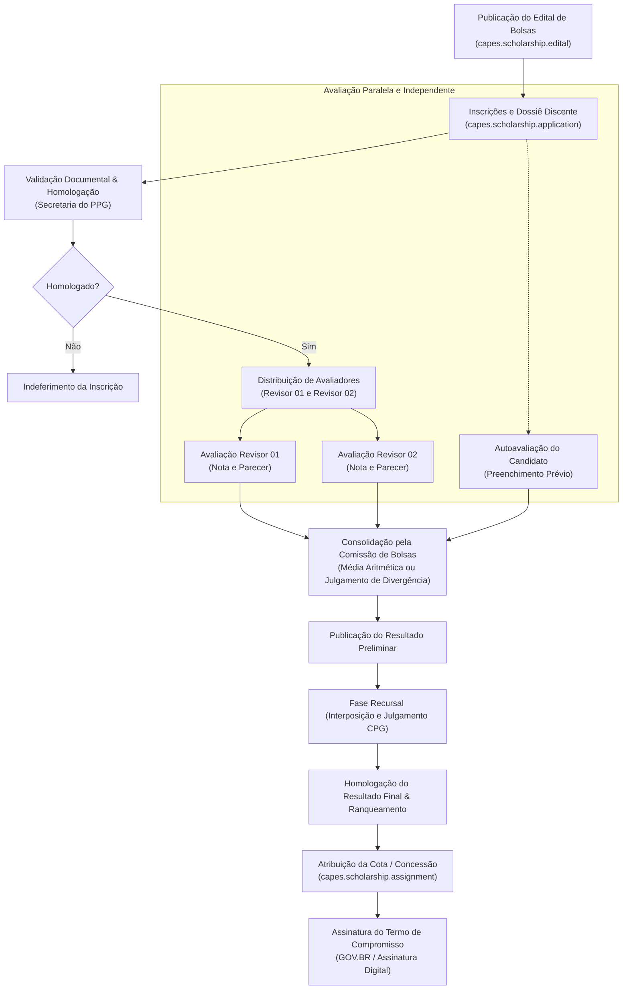
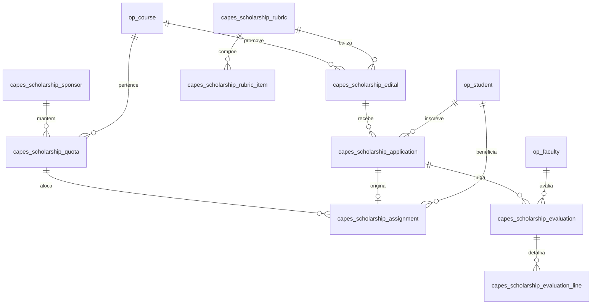

# Documento 05: Gestão de Cotas e Editais de Bolsas de Estudo (`l10n_br_openeducat_capes_scholarship`)

## 1. Contexto Regulatório e Premissa Fundamental de Domínio

A concessão e o acompanhamento de bolsas de estudo na pós-graduação *Stricto Sensu* brasileira são regidos por normativas federais (Portarias CAPES e CNPq), regulamentos estaduais de Fundações de Amparo à Pesquisa (FAPs) e instruções normativas de institutos de pesquisa (ex.: Instrução Normativa CNEN nº 07/2024 e Portaria Interna CPG-IPEN nº 01/2024).

### 1.1. Delimitação Funcional: Controle Acadêmico de Cotas vs. Gestão Financeira Direta
> [!IMPORTANT]
> **O Programa de Pós-Graduação (PPG) NÃO realiza a liquidação nem o pagamento financeiro das bolsas.**
> O desembolso financeiro das mensalidades (R$ 2.100,00 para Mestrado, R$ 3.100,00 para Doutorado, ou valores fixados pelas agências) é executado **diretamente entre o órgão de fomento (CAPES, CNPq, CNEN, FAPESP) e o discente**, mediante crédito em conta corrente do bolsista.
> 
> A responsabilidade da IES e da Coordenação/Secretaria do PPG reside no **controle rigoroso do ciclo de vida acadêmico das cotas**:
> 1. Alocação e saldo do Livro de Cotas por agência mantenedora;
> 2. Publicação e julgamento dos Editais de Seleção e Distribuição de Bolsas;
> 3. Avaliação cega e independente por múltiplos revisores com baremas dinâmicos;
> 4. Verificação de elegibilidade, dedicação e travas regulamentares de acúmulo com atividade remunerada (Portaria CAPES nº 133/2023);
> 5. Acompanhamento de prazos máximos regulamentares (24 meses para Mestrado e 48 meses para Doutorado, deduzindo-se meses usufruídos anteriormente);
> 6. Auditoria de frequência semestral (mínimo de 80%) e entrega de relatórios anuais de atividades;
> 7. Suspensão formal (licença-maternidade/saúde) e cancelamento tempestivo para evitar pagamentos indevidos e obrigação de devolução de recursos públicos.

---

## 2. Marco Regulatório Aplicável

| Diploma Legal | Objeto e Impacto no Módulo | Regra Sistêmica Implementada |
| :--- | :--- | :--- |
| **Portaria CAPES nº 133/2023** | Flexibilização do acúmulo de bolsas de pós-graduação com atividade remunerada e outros rendimentos. | Formulário de Declaração de Dedicação e Vínculo Empregatício; submissão obrigatória à deliberação da CPG; trava para aposentados (0 pontos em editais IPEN). |
| **IN CNEN nº 07/2024** | Normas e diretrizes gerais para bolsas de estudo e pesquisa do IPEN/CNEN. | Exigência de dedicação semanal de 40h (preferencialmente das 8h às 17h); residência compatível em São Paulo ou região metropolitana; termo de compromisso institucional. |
| **Portaria CAPES nº 221/2025** | Regulamentação do Estágio de Docência para bolsistas. | Integração com `op.curriculum.version` e o motor de integralização de créditos para bolsistas ativos. |
| **Normas Gerais CAPES/CNPq** | Limite temporal improrrogável de concessão. | Trava de 24 meses para Mestrado e 48 meses para Doutorado (descontando meses anteriores já computados no mesmo nível). |
| **Ações Afirmativas (MEC/Governo Federal)** | Reserva de cotas para minorias étnico-raciais e PcD em processos seletivos. | Vagas reservadas para Pretos, Pardos e Indígenas (PPI), com formulário de autodeclaração voluntária e regra de reversão de cotas remanescentes para ampla concorrência. |

---

## 3. Arquitetura de Processos e Fluxos de Avaliação

O módulo atende de forma unificada tanto ao modelo quantitativo analítico com tetos do **IPEN Acadêmico (Editais 06/2026 e 02/2025)** quanto ao modelo matricial quali-quantitativo do **Mestrado Profissional MP-TRCS (Edital 05/2026)**.

### 3.1. Macrofluxo de Seleção e Julgamento

### 3.2. Avaliação Paralela em 4 Colunas (Padrão IPEN)
A avaliação opera com quatro visões independentes consolidadas em matriz única:
1. **Coluna 1 — Autoavaliação do Candidato:** O aluno pontua previamente cada item do barema e indica a página comprobatória no dossiê em PDF.
2. **Coluna 2 — Revisor 01:** Docente avaliador designado pela CPG analisa as evidências e lança notas/glosas de forma cega/independente.
3. **Coluna 3 — Revisor 02:** Segundo docente avaliador analisa em paralelo, sem visualizar as notas do Revisor 01.
4. **Coluna 4 — Consolidação:** A Comissão de Bolsas / CPG confere a nota aritmética média dos revisores ou aplica a nota final consolidada com fé pública.

---

## 4. Engenharia de Dados e Modelagem de Classes

### 4.1. `capes.scholarship.sponsor` (Agências de Fomento)
Cadastra as fontes pagadoras das bolsas.
* `name` (Char): Razão social (ex.: Coordenação de Aperfeiçoamento de Pessoal de Nível Superior - CAPES).
* `code` (Char): Código mnemônico (`CAPES`, `CNPq`, `CNEN`, `FAPESP`, `EMPRESA`).
* `sponsor_type` (Selection): `federal`, `state`, `institutional`, `private`.
* `notes` (Text): Regramentos gerais da mantenedora.

### 4.2. `capes.scholarship.quota` (Livro de Cotas Institucionais)
Controla o saldo de bolsas disponibilizadas ao programa de pós-graduação.
* `name` (Char): Identificador da cota (ex.: Cota CAPES-PROEX Mestrado 2026/2027).
* `sponsor_id` (Many2one -> `capes.scholarship.sponsor`): Agência mantenedora.
* `course_id` (Many2one -> `op.course`): Curso/PPG nativo OpenEduCat proprietário da cota.
* `program_id` (Many2one -> `op.program.capes`): Programa CAPES associado.
* `level` (Selection): `master_acad`, `master_prof`, `phd`, `direct_phd`.
* `total_slots` (Integer): Quantidade total de vagas concedidas pela agência.
* `used_slots` (Integer, Computed): Bolsas atualmente implementadas e ativas.
* `available_slots` (Integer, Computed): Saldo disponível para novos editais (`total_slots - used_slots`).
* `monthly_reference_amount` (Monetary): Valor referencial de repasse direto pela agência (ex.: R$ 2.100,00 ou R$ 3.100,00).
* `validity_start` (Date): Início da vigência da cota no programa.
* `validity_end` (Date): Fim da vigência da cota.
* `active` (Boolean): Flag de ativação.

### 4.3. `capes.scholarship.rubric` e `capes.scholarship.rubric.item` (Baremas Parametrizados)
Elimina qualquer hardcode regimental, modelando regras de pontuação para o Programa Acadêmico e para o Mestrado Profissional.
* **Modelo `capes.scholarship.rubric`:**
  * `name` (Char): Título do Barema (ex.: Barema IPEN Acadêmico - Mestrado 125 pts).
  * `level` (Selection): Nível de aplicação (`master_acad`, `master_prof`, `phd`, `direct_phd`).
  * `scoring_model` (Selection):
    * `analytical_points`: Modelo por pontuação analítica com tetos (Padrão IPEN).
    * `likert_scale`: Modelo por dimensões quali-quanti em escala 1 a 5 (Padrão MP-TRCS).
  * `total_max_points` (Float): Pontuação máxima global (ex.: 125 no ME, 190 no DO).
  * `item_ids` (One2many -> `capes.scholarship.rubric.item`): Linhas de pontuação.

* **Modelo `capes.scholarship.rubric.item`:**
  * `rubric_id` (Many2one -> `capes.scholarship.rubric`).
  * `category` (Selection):
    * `work_plan`: Plano de trabalho aprovado.
    * `enade`: Avaliação ENADE da IES de origem.
    * `graduation_time`: Duração do curso de graduação (penalidades por prorrogação).
    * `graduation_grades`: Média aritmética de conceitos/notas da graduação.
    * `postgrad_previous`: Mestrado prévio (Conceito CAPES, tempo de depósito, notas).
    * `internship_ic`: Iniciação Científica e estágios com/sem bolsa.
    * `scientific_production`: Artigos periódicos (Qualis/Scimago Q1-Q4), congressos, livros, patentes.
    * `research_projects`: Projetos de pesquisa com fomento.
    * `dedication`: Grau de dedicação à pós-graduação e acúmulo de vínculo.
    * `professional_experience`: Experiência profissional no setor (para MP).
  * `name` (Char): Descrição do critério (ex.: "Artigo Periódico Qualis Q1").
  * `base_points` (Float): Valor base do item ou peso na escala.
  * `category_cap_points` (Float): Teto máximo do bloco/categoria (ex.: máx. 30 pts em produção científica).
  * `calculation_formula` (Selection):
    * `fixed`: Valor fixo (ex.: Plano Aprovado = 10 pts).
    * `linear_months`: Fórmula linear por meses (ex.: $y = ax + b$).
    * `authorship_split`: Rateio integral até 2 autores; divisão pelo total se $> 2$.
    * `direct_score`: Atribuição direta de nota pelo revisor (escala 1 a 5).

### 4.4. `capes.scholarship.edital` (Edital de Concessão de Bolsas)
* `name` (Char): Identificador oficial (ex.: Edital de Bolsas nº 06/2026).
* `course_id` (Many2one -> `op.course`): Curso/PPG nativo responsável.
* `program_id` (Many2one -> `op.program.capes`): Programa CAPES associado.
* `academic_year_id` (Many2one -> `op.academic.year`): Ano de referência.
* `rubric_id` (Many2one -> `capes.scholarship.rubric`): Barema adotado.
* `quota_id` (Many2one -> `capes.scholarship.quota`): Cota institucional vinculada.
* `date_start` (Date): Abertura do período de inscrições.
* `date_end` (Date): Encerramento de inscrições.
* `date_preliminary_result` (Datetime): Divulgação do resultado preliminar.
* `date_appeals_end` (Datetime): Prazo fatal para protocolo de recursos.
* `date_final_result` (Datetime): Publicação do resultado final homologado.
* **Quadro de Vagas:**
  * `slots_open_competition` (Integer): Vagas para Ampla Concorrência.
  * `slots_affirmative_action` (Integer): Vagas reservadas para PPI / Ações Afirmativas.
  * `revert_unused_affirmative_slots` (Boolean): Reversão automática de cotas PPI ociosas para ampla concorrência.
* `state` (Selection): `draft` $\rightarrow$ `open` $\rightarrow$ `evaluation` $\rightarrow$ `preliminary` $\rightarrow$ `appeals` $\rightarrow$ `homologated` $\rightarrow$ `closed`.

### 4.5. `capes.scholarship.application` (Ficha de Inscrição e Candidatura)
* `edital_id` (Many2one -> `capes.scholarship.edital`).
* `student_id` (Many2one -> `op.student`): Discente candidato.
* `faculty_id` (Many2one -> `op.faculty`): Orientador responsável.
* `quota_type` (Selection): `ampla` (Ampla Concorrência) vs. `ppi` (Ações Afirmativas PPI).
* `affirmative_declaration_file` (Binary): Anexo da autodeclaração voluntária assinada.
* `lattes_url` (Char): Link obrigatório do Currículo Lattes.
* `work_plan_file` (Binary): Arquivo do plano de trabalho de pesquisa.
* `work_plan_approved_cpg` (Boolean): Homologado previamente pela CPG.
* **Dedicação e Declaração de Acúmulo (Portaria CAPES 133/2023):**
  * `dedication_mode` (Selection):
    * `exclusive`: Dedicação exclusiva sem qualquer renda/aposentadoria.
    * `partial_teaching`: Atividade docente autorizada pela CPG.
    * `partial_other`: Outra atividade remunerada com vínculo externo.
    * `retired`: Aposentado.
  * `weekly_work_hours` (Integer): Carga horária semanal da atividade externa.
  * `employer_name` (Char): Empregador ou instituição onde exerce atividade.
  * `cpg_approval_date` (Date): Data da deliberação favorável da CPG para o acúmulo.
* `final_score` (Float): Nota final consolidada após julgamento.
* `ranking_position` (Integer): Posição final na classificação do edital.
* `state` (Selection): `draft` $\rightarrow$ `submitted` $\rightarrow$ `homologated` $\rightarrow$ `under_review` $\rightarrow$ `ranked` $\rightarrow$ `awarded` $\rightarrow$ `rejected`.

### 4.6. `capes.scholarship.evaluation` e `capes.scholarship.evaluation.line` (Avaliação Paralela)
* `application_id` (Many2one -> `capes.scholarship.application`).
* `evaluator_role` (Selection): `candidate_self` (Autoavaliação), `reviewer_1`, `reviewer_2`, `committee` (Consolidação da Comissão).
* `evaluator_id` (Many2one -> `op.faculty` / `res.users`): Docente avaliador responsável.
* `total_score` (Float): Soma apurada das linhas do barema.
* `reviewer_comments` (Text): Parecer fundamentado do avaliador.
* `state` (Selection): `draft` $\rightarrow$ `completed`.
* **Linhas de Avaliação (`capes.scholarship.evaluation.line`):**
  * `rubric_item_id` (Many2one -> `capes.scholarship.rubric.item`).
  * `quantity_or_units` (Float): Quantidade informada (ex.: 3 artigos Q1, 14 meses de IC).
  * `dossier_page_ref` (Char): Folha/Página de comprovação indicada no dossiê.
  * `calculated_score` (Float): Nota pontuada após aplicação de fórmula e teto.

### 4.7. `capes.scholarship.assignment` (Ciclo de Vida e Acompanhamento da Concessão)
* `quota_id` (Many2one -> `capes.scholarship.quota`): Cota de origem.
* `application_id` (Many2one -> `capes.scholarship.application`): Candidatura que gerou a concessão.
* `student_id` (Many2one -> `op.student`): Aluno bolsista.
* `course_id` (Many2one -> `op.course`).
* `date_start` (Date): Início da vigência da bolsa para o discente.
* `date_end_expected` (Date): Término regulamentar previsto.
* `date_termination` (Date): Término real (em caso de encerramento antecipado ou titulação).
* **Controle de Meses e Travas:**
  * `prior_months_used` (Integer): Meses de bolsa usufruídos previamente no mesmo nível.
  * `max_allowed_months` (Integer): Teto regulamentar (24 meses Mestrado / 48 meses Doutorado).
  * `current_months_active` (Integer, Computed): Meses ativos no programa.
  * `remaining_months` (Integer, Computed): `max_allowed_months - (prior_months_used + current_months_active)`.
* **Conformidade Operacional:**
  * `commitment_term_signed` (Boolean): Termo de compromisso formalmente assinado e arquivado.
  * `commitment_term_attachment` (Binary): PDF do termo com assinatura digital GOV.BR.
  * `attendance_rate` (Float): Percentual de frequência nas atividades (mínimo de 80%).
  * `last_annual_report_date` (Date): Data da homologação do último relatório de atividades.
* `state` (Selection): `active` $\rightarrow$ `suspended` (licença saúde/maternidade) $\rightarrow$ `completed` (titulação) $\rightarrow$ `canceled` (desistência, acúmulo ilícito ou desligamento).

---

## 5. Matriz de Segurança e Níveis de Acesso

O módulo segue rigorosamente o princípio do menor privilégio e o isolamento de dados de candidatos e avaliadores:

| Papel / Perfil de Usuário | Modelo / Objeto | Nível de Acesso (CRUD) | Regra de Registro (Record Rule) |
| :--- | :--- | :--- | :--- |
| **Discente (Aluno)** | `capes.scholarship.application` | Leitura / Criação / Escrita (apenas em `draft`) | Restrito aos registros onde `student_id.user_id = user.id`. Bloqueio total de visibilidade de outros candidatos. |
| **Discente (Aluno)** | `capes.scholarship.evaluation` | Leitura / Escrita (apenas para autoavaliação) | Restrito a `evaluator_role = 'candidate_self'` e `application_id.student_id.user_id = user.id`. |
| **Discente (Aluno)** | `capes.scholarship.assignment` | Apenas Leitura | Restrito aos seus próprios termos e vigências onde `student_id.user_id = user.id`. |
| **Docente (Avaliador)** | `capes.scholarship.evaluation` | Leitura / Escrita | Restrito aos registros onde foi explicitamente designado (`evaluator_id.user_id = user.id`). Não pode editar a avaliação do outro revisor. |
| **Docente (Avaliador)** | `capes.scholarship.application` | Apenas Leitura | Visualização do dossiê das candidaturas designadas para seu julgamento. |
| **Secretaria do PPG** | Todos os Modelos | CRUD Completo | Gestão de cotas, conferência de inscrições, verificação de frequência e termos de compromisso. |
| **Coordenação / CPG** | Todos os Modelos | CRUD Completo + Homologação | Designação de revisores, consolidação de notas, deliberação de recursos e autorização de acúmulo de bolsa. |
| **Administrador** | Todos os Modelos | Acesso irrestrito | Configuração global de agências, templates de baremas e permissões de sistema. |

---

## 6. Integração e Relação com a Arquitetura Global

1. **Visão 360° do Discente (`op.student`):**
   * Injeção de smart button `Bolsas de Estudo` exibindo o histórico de cotas, vigências e situação ativa/inativa.
   * Exibição de badge visual de status de fomento (ex.: "Bolsista CAPES-PROEX Ativo").
2. **Visão 360° do Docente (`op.faculty`):**
   * Smart button com as avaliações de bolsas pendentes e concluídas como Revisor Designado.
   * Painel de orientandos bolsistas e cumprimento do estágio de docência.
3. **Pauta e Atas da CPG (`op.cpg.meeting`):**
   * Registro automatizado de pauta para homologação de editais de bolsas, resultado final da seleção e deliberações de acúmulo remunerado sob a Portaria CAPES nº 133/2023.
