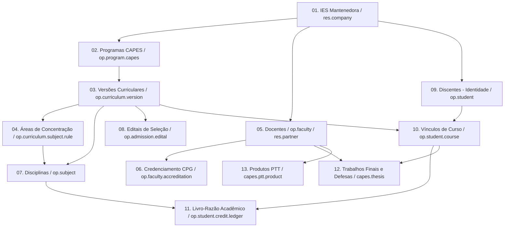

# Guia Técnico de Inicialização em Banco Zerado e Migração de Dados
## Ecossistema l10n_br_openeducat_capes (Odoo 19.0 / OpenEduCat 19.0)

Este documento estabelece o protocolo técnico operacional para administradores e equipes de TI responsáveis por disponibilizar o sistema a partir de uma instalação nova (banco de dados zerado), configurar a instituição e migrar dados históricos oriundos de sistemas legados.

---

## 1. Topologia de Instalação e Subida do Stack

Após clonar o repositório oficial e seguir os passos iniciais do `README.md`:

1. **Download das dependências externas:**
   ```bash
   ./scripts/fetch_dependencies.sh
   ```
2. **Configuração de ambiente:**
   Copie o arquivo `.env.example` para `.env` e configure a Master Password (`ODOO_ADMIN_PASSWD`), portas e credenciais do PostgreSQL 16.
3. **Inicialização dos contêineres:**
   ```bash
   docker compose up -d --build
   ```
4. **Verificação dos logs:**
   Certifique-se de que o Odoo 19 e o PostgreSQL 16 subiram sem advertências críticas:
   ```bash
   docker compose logs -f odoo
   ```

---

## 2. Criação da Base de Dados Limpa (Sem Dados Demo)

Para garantir integridade regulatória estrita e fé pública perante a CAPES, o banco de dados de produção **nunca** deve conter dados de demonstração (*demo data*):

1. Acesse o gerenciador de bancos de dados: `http://localhost:8069/web/database/manager` (ou IP configurado no `BIND_HOST`).
2. Clique em **Create Database**:
   * **Database Name:** Nome padronizado da instituição/programa (ex: `ppg_universidade_prod` ou `mptrcs_ipen_prod`).
   * **Email:** E-mail oficial do Administrador do Sistema (ex: `admin@instituicao.br`).
   * **Password:** Senha administrativa mestra de alta entropia.
   * **Language:** `Portuguese (BR) / Português (BR)`.
   * **Country:** `Brazil / Brasil`.
   * **Demo data:** ⏹️ **DESMARCADO (UNCHECKED)**. É mandatório que esta caixa permaneça desmarcada.
3. Clique em **Continue** e aguarde a inicialização da base.

---

## 3. Instalação e Ativação dos Módulos

Ao acessar o sistema pela primeira vez com o usuário administrador:

1. Acesse o menu **Configurações** (`Settings`) e role até o rodapé para ativar o **Modo Desenvolvedor** (`Activate Developer Mode`).
2. Acesse o menu **Aplicativos** (`Apps`).
3. Clique em **Atualizar Lista de Aplicativos** (`Update Apps List`).
4. Na barra de pesquisa, remova o filtro padrão `Aplicativos` (`Apps`) para exibir todos os módulos técnicos.
5. Localize e instale os submódulos de topo da cadeia de dependências:
   * **`l10n_br_openeducat_capes_diploma`**
   * **`l10n_br_openeducat_capes_scholarship`**
   * *Nota Arquitetural:* A instalação destes dois módulos provisiona automaticamente toda a árvore de 9 submódulos do monorepo:
     `openeducat_core` $\rightarrow$ `core` $\rightarrow$ `admission` $\rightarrow$ `academic` $\rightarrow$ `research` $\rightarrow$ `thesis` $\rightarrow$ `ptt` $\rightarrow$ `integration` $\rightarrow$ `diploma` & `scholarship`.

---

## 4. Parametrizações Iniciais do Sistema

Antes de iniciar qualquer importação de dados, realize as seguintes configurações institucionais na interface:

### 4.1. Dados da Empresa Mantenedora / IES (`res.company`)
Acesse **Configurações $\rightarrow$ Usuários & Empresas $\rightarrow$ Empresas**:
* **Nome:** Nome oficial por extenso da IES (ex: `Universidade XYZQ` ou `Instituto de Pesquisas Energéticas e Nucleares - IPEN-CNEN/SP`).
* **CNPJ:** CNPJ oficial formatado.
* **Código e-MEC:** Código institucional no Ministério da Educação.
* **Endereço Completo:** Logradouro, Bairro, Município, UF, CEP e Código IBGE do município.

### 4.2. Parametrização de Parâmetros de Sistema (`ir.config_parameter`)
Em **Configurações $\rightarrow$ Técnico $\rightarrow$ Parâmetros do Sistema**:
* `web.base.url`: URL canônica acessível pelos usuários (ex: `https://posgraduacao.instituicao.br`).
* `web.base.url.freeze`: Valor booleano `True` para evitar que o Odoo altere a URL base dinamicamente.

### 4.3. Configurações Estruturais do OpenEduCat
Acesse o menu **OpenEduCat $\rightarrow$ Configuração** para validar ou cadastrar as entidades estruturais do calendário e organograma acadêmico:
* **Anos Acadêmicos (`op.academic.year`):** Ex: "2024", "2025", "2026" com datas de início e término.
* **Períodos / Termos Acadêmicos (`op.academic.term`):** Semestres letivos (ex: "1º Semestre 2024", "2º Semestre 2024").
* **Departamentos (`op.department`):** Unidades acadêmicas da IES (ex: "Departamento de Ciência da Computação", "Centro de Radiologia").
* **Nível e Programa Educacional (`op.program.level` e `op.program`):** Definição de níveis Stricto Sensu e programas gerais.
* **Cursos (`op.course`):** Vinculados ao programa e departamento.
* **Turmas / Lotes Discentes (`op.batch`):** Coortes com vinculação direta ao programa (`program_id`).
* **Categorias Discentes (`op.category`):** Segmentações de financiamento (ex: "Regular", "Bolsista CAPES", "Bolsista CNPq").

### 4.4. Usuários Operacionais, Perfis de Acesso e Governança Multiprograma
Acesse **Configurações $\rightarrow$ Usuários & Empresas $\rightarrow$ Usuários** para cadastrar os operadores com seus devidos grupos e programas autorizados:

| Login | Perfil / Função | Grupo Odoo 19 | Escopo de Programas (`res.users`) |
| --- | --- | --- | --- |
| `admin` | Administrador Geral de TI | `base.group_system`, `group_op_back_office_admin` | Global (`is_central_admin = True`) |
| `prpg_admin` | Pró-Reitoria de Pós-Graduação | `group_capes_central_admin`, `group_op_back_office_admin` | Global (`is_central_admin = True`) |
| `secretaria` | Secretaria Setorial Monoprograma | `group_capes_program_secretary`, `group_op_back_office_admin` | 1 Programa (`allowed_program_ids`) |
| `secretaria_multi`| Secretaria Compartilhada Multiprograma | `group_capes_program_secretary`, `group_op_back_office_admin` | N Programas (`allowed_program_ids`) |
| `coordenador` | Coordenador do Programa | `group_capes_program_coordinator`, `group_op_back_office_admin` | 1 ou + Programas (`allowed_program_ids`) |
| `professor` | Docente e Orientador | `openeducat_core.group_op_faculty` | Orientandos e Disciplinas |
| `aluno` | Discente de Pós-Graduação | `base.group_portal` | Estrito ao próprio ID Discente |

*Aba Governança Pós-Graduação CAPES:* No formulário de cada usuário técnico, configure os campos `allowed_program_ids` (programas permitidos), `current_program_id` (programa inicial padrão) e marque `is_central_admin` para a equipe da Pró-Reitoria.

---

## 5. Sequência Rígida de Carga de Dados (Resolução de Chaves Estrangeiras)

Na importação em lote de dados legados via planilhas CSV, a ordem de carga é estrita para evitar erros de integridade referencial (*Foreign Key Constraint Violations*):



---

## 6. Mapeamento e Descrição dos 13 Passos de Carga

### Passo 01: Instituição de Ensino Superior (`res.company`)
* **Modelo:** `res.company`
* **Finalidade:** Estabelece a pessoa jurídica mantenedora e âncora da identidade discente soberana.
* **Campos Críticos:** `id` (identificador externo XML ID), `name`, `cnpj` (validação Módulo 11), `emec_code`, `street`, `city`, `zip`, `country_id/code` (`BR`).

### Passo 02: Programas de Pós-Graduação (`op.program.capes`)
* **Modelo:** `op.program.capes`
* **Finalidade:** Cadastra os programas stricto sensu vinculados à CAPES / SNPG.
* **Campos Críticos:** `id`, `name`, `short_name`, `snpg_code` (Código SNPG da CAPES), `modality` (`academic` ou `professional`), `capes_grade` (`3` a `7`), `school_term` (`semestral`), `company_id/id`.

### Passo 03: Versões Curriculares e Regimentos (`op.curriculum.version`)
* **Modelo:** `op.curriculum.version`
* **Finalidade:** Blinda o Ato Jurídico Perfeito fixando matriz de créditos e regras regimentais.
* **Campos Críticos:** `id`, `name`, `program_id/id`, `min_credits`, `min_subject_credits`, `thesis_credits`, `other_mandatory_credits`, `credit_hour_ratio`, `max_external_credits_percent`, `max_months_defense`, `allow_special_students`, `max_special_subjects_limit`, `special_credit_validity_months`, `special_incorporation_workflow` (`cpg_approval`/`direct_request`), `special_transcript_fail_policy` (`omit_on_regular`/`display_all`), `allow_intra_ies_credits`, `max_intra_ies_credits_percent`, `intra_ies_advisor_approval_required`, `retorno_rule`, `grading_scale_type`, `proficiency_stage`, `teaching_internship_mode`, `ptt_validation_mode`, `defense_location_policy`.

### Passo 04: Áreas de Concentração e Linhas de Pesquisa (`op.curriculum.subject.rule`)
* **Modelo:** `op.curriculum.subject.rule`
* **Finalidade:** Estruturação das áreas de conhecimento do programa.
* **Campos Críticos:** `id`, `name`, `curriculum_version_id/id`, `description`.

### Passo 05: Corpo Docente e Orientadores (`op.faculty` / `res.partner`)
* **Modelo:** `op.faculty`
* **Finalidade:** Cadastra professores com identificadores biográficos internacionais (PIDs) e cria automaticamente o parceiro (`res.partner`).
* **Campos Críticos:** `id`, `name`, `cpf` (11 dígitos numéricos com validação Módulo 11), `email`, `orcid`, `lattes_url`, `gender` (`male` ou `female`), `birth_date`.

### Passo 06: Credenciamento Docente perante a CPG (`op.faculty.accreditation`)
* **Modelo:** `op.faculty.accreditation`
* **Finalidade:** Histórico de credenciamento (Permanente, Colaborador, Visitante) por programa perante a CPG.
* **Campos Críticos:** `id`, `faculty_id/id`, `program_id/id`, `category` (`permanent`, `collaborator`, `visitor`), `date_start`, `date_end`.

### Passo 07: Catálogo de Disciplinas (`op.subject`)
* **Modelo:** `op.subject`
* **Finalidade:** Disciplinas oferecidas pelo PPG, cargas horárias e regras de acesso.
* **Campos Críticos:** `id`, `code`, `name`, `program_id/id`, `rule_id/id` (Área de Concentração), `type` (`theory`, `practical`, `both`), `subject_type` (`compulsory` ou `elective`), `credits`, `hours`, `allow_special_students`, `special_seats_quota`, `special_student_instructor_consent_required`.

### Passo 08: Processos Seletivos e Editais (`op.admission.edital`)
* **Modelo:** `op.admission.edital`
* **Finalidade:** Registro de editais para programas que admitem por turma/concurso.
* **Campos Críticos:** `id`, `name`, `code`, `program_id/id`, `curriculum_version_id/id`, `academic_year`, `academic_term` (`1` ou `2`), `total_slots`, `affirmative_action_percent`, `start_date`, `end_date`, `state` (`draft`, `published`, `in_selection`, `homologated`, `cancelled`).

### Passo 09: Identidade Soberana Discente (`op.student` / `res.partner`)
* **Modelo:** `op.student`
* **Finalidade:** Cadastro permanente e vitalício da pessoa como estudante na IES, indexado por CPF e IES (`res.company`).
* **Campos Críticos:** `id`, `name`, `cpf` (11 dígitos numéricos com validação Módulo 11), `email`, `ra_number` (Registro Acadêmico perene), `gr_no`, `company_id/id`, `student_category` (`regular`, `special`, `alumni`), `gender` (`m`, `f`, `o`), `birth_date`, `admission_date`, `english_proficiency_status` (`pending`, `approved`, `exempt`), `portuguese_proficiency_status` (`not_applicable`, `pending`, `approved`).

### Passo 10: Vínculos de Curso Discente (`op.student.course`)
* **Modelo:** `op.student.course`
* **Finalidade:** Vinculação do discente a um curso/programa em determinado regime (Multi-Vínculo).
* **Campos Críticos:** `id`, `student_id/id`, `course_id/id`, `program_id/id`, `curriculum_version_id/id`, `course_type` (`regular` ou `special`), `state` (`running`, `finished`, `canceled`), `admission_date`, `completion_date`.

### Passo 11: Livro-Razão Acadêmico de Créditos (`op.student.credit.ledger`)
* **Modelo:** `op.student.credit.ledger`
* **Finalidade:** Registro imutável (*append-only*) de integralização de créditos e notas.
* **Campos Críticos:** `id`, `student_id/id`, `curriculum_version_id/id`, `subject_id/id`, `course_name`, `credit_type` (`subject_internal`, `subject_intra_ies`, `subject_special_quarantine`, `subject_special_incorporated`, `subject_extra_ies`, `apo`, `milestone`, `external`), `credits`, `hours`, `grade_concept` (`A`, `B`, `C`, `D`, `R`), `is_approved`, `date_earned`, `origin_ref`.

### Passo 12: Ritos Bipartidos e Defesas Finais (`capes.thesis`)
* **Modelo:** `capes.thesis`
* **Finalidade:** Histórico de bancas de qualificação e defesa, membros e handles do DSpace.
* **Campos Críticos:** `id`, `student_id/id`, `work_plan_id/id` (obrigatório para defesas), `curriculum_version_id/id`, `title`, `doc_type` (`dissertation`, `thesis`, `tech_product`), `stage` (`seminar_area`, `qualification`, `defense`), `status` (`draft`, `scheduled`, `approved`, `disapproved`, `deposit_pending`, `final_version_submitted`, `homologated`), `defense_date`, `repository_url` (Handle DSpace), `advisor_id/id`.

### Passo 13: Produtos Técnico-Tecnológicos (`capes.ptt.product`)
* **Modelo:** `capes.ptt.product`
* **Finalidade:** Acervo de produção técnica, classificação em eixos (E1-E4), tipologias (T01-T21) e TRL.
* **Campos Críticos:** `id`, `title`, `name`, `thesis_id/id`, `student_id/id`, `axis_id/id`, `type_id/id`, `final_stratum` (`T1` a `T5`, `TNC`), `trl_level` (`trl_1` a `trl_9`), `adherence_justif`, `state` (`draft`, `adherence_check`, `evaluating`, `homologated`, `rejected`).

---

## 7. Metodologia de Migração de Dados Legados

Para migrações em larga escala a partir de sistemas legados (ex: planilhas legadas, sistemas legados acadêmicos universitários, bancos SQL antigos):

1. **Extração e Higienização:**
   * Unifique CPFs: remova pontos, traços e espaços, mantendo exatamente 11 dígitos com preenchimento à esquerda com zeros.
   * Valide e-mails e converta nomes próprios para Title Case.
   * Padronize datas no formato ISO-8601: `YYYY-MM-DD`.
2. **Construção das Chaves Externas (XML IDs):**
   * Utilize prefixos mnemônicos estruturados no campo `id` para permitir reimportações idempotentes sem duplicação de dados:
     * Programas: `prog_<snpg_code>` (ex: `prog_33002010001P0`)
     * Regimentos: `reg_<snpg_code>_<ano>` (ex: `reg_33002010001P0_2024`)
     * Docentes: `fac_<cpf>` (ex: `fac_11122233344`)
     * Disciplinas: `sub_<codigo>` (ex: `sub_RAD5001`)
     * Discentes: `stu_<cpf>` (ex: `stu_55566677788`)
     * Vínculos: `link_<cpf>_<tipo>_<ano>` (ex: `link_55566677788_reg_2024`)
     * Ledger: `led_<cpf>_<disciplina>_<ano>` (ex: `led_55566677788_RAD5001_2024`)
3. **Execução em Lote e Verificação de Erros:**
   * Utilize a interface do Odoo (*Importar Registros*) ou via script Python com a biblioteca `xmlrpc.client` / `odoo-bin shell`.
   * Clique em **Testar Importação** (*Test Import*) antes de consolidar a gravação no banco de dados.

---

## 8. Procedimento Prático de Importação na Interface Web do Odoo 19

Para cada um dos 13 arquivos CSV gerados:

1. Acesse a tela correspondente no Odoo (ex: *Ensino CAPES $\rightarrow$ Configurações $\rightarrow$ Versões Regimentais* ou *OpenEduCat $\rightarrow$ Professores*).
2. Clique no menu **Favoritos** (ou ícone de engrenagem no topo da lista) $\rightarrow$ **Importar Registros**.
3. Clique em **Carregar Arquivo** e selecione o CSV correspondente.
4. O Odoo preencherá automaticamente o mapa "De / Para":
   * Verifique se as colunas com notação de chave estrangeira (ex: `company_id/id`, `program_id/id`, `student_id/id`) foram mapeadas para o campo de ID Externo correspondente.
5. Clique no botão **Testar (Test)**:
   * **Sucesso (Caixa Verde):** *"Tudo parece correto"*. Clique em **Importar** para efetivar os registros.
   * **Erro (Caixa Vermelha):** O Odoo indicará a linha exata e a coluna com divergência (ex: *Chave externa não encontrada*). Corrija a dependência na planilha e teste novamente.

---

## 9. Checklist de Auditoria Pós-Migração

Após concluir a importação dos 13 passos em uma base de dados nova:

1. ✅ **Conferência de Créditos e Livro-Razão:** Acesse discentes amostrais em *Alunos*, abra a visão do *Livro-Razão de Créditos* e valide se o total somado e a taxonomia de créditos coincidem com o acervo do sistema legado.
2. ✅ **Validação do Ato Jurídico Perfeito:** Confirme se cada aluno está vinculado à versão regimental correta correspondente ao seu ano/semestre de ingresso.
3. ✅ **Auditoria de Quarentena e Trânsito:** Verifique se eventuais disciplinas cursadas em regime especial permanecem com o tipo `subject_special_quarantine` e que não foram somadas indevidamente aos créditos de titulação.
4. ✅ **Emissão do Histórico Escolar Consolidado:** Em um discente titulado (`completed` / `homologated`), gere a impressão do *Histórico Escolar Oficial* em QWeb PDF e valide a ausência de inconsistências ou reprovações de regimes isolados (`omit_on_regular`).
5. ✅ **Verificação de PTTs e DSpace:** Confirme se os trabalhos finais de programas profissionais possuem seus produtos PTT classificados e os handles persistentes averbados.
6. ✅ **Validação da Visão 360° Discente e Docente:** Acesse a ficha de discentes e docentes para confirmar que os smart buttons (créditos, vínculos, defesas, orientandos, turmas lecionadas, linhas de pesquisa) estão calculando e exibindo valores reais e clicáveis.
7. ✅ **Validação dos Menus Estruturais do OpenEduCat:** Acesse *OpenEduCat $\rightarrow$ Configuração* e confira se Anos Acadêmicos, Períodos Letivos, Departamentos, Cursos e Turmas (`op.batch`) estão visíveis e vinculados aos alunos.
8. ✅ **Autenticação e Perfis de Usuário:** Teste o login nos perfis padrão (`secretaria`, `coordenador`, `vicecoordenador`, `professor`) para certificar-se de que os privilégios e permissões de acesso estão de acordo com o manual operacional de cada cargo.

