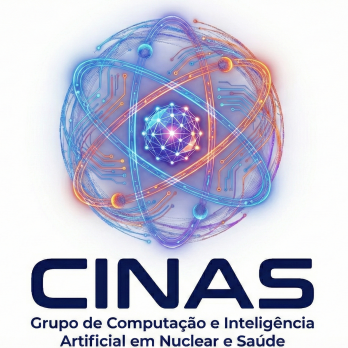

## O Cenário da Pós-Graduação Nacional

### Complexidade Estrutural e Impacto Científico

::: {.columns}
::: {.column width="55%"}
* **Mais de 4.500 programas de pós-graduação** formam a liderança científica e técnica do Brasil.
* **Avaliação Quadrienal Decisiva da CAPES:** Determina as notas de excelência (3 a 7), o orçamento institucional e a distribuição de bolsas de estudo.
* **Conformidade Contínua e Rigorosa:** Portarias federais da CAPES, normas do MEC e regimentos internos exigem auditoria permanente.
:::

::: {.column width="45%"}
::: {.card .card-warning}
#### O Gargalo das Instituições
A maioria das Universidades e Institutos opera com sistemas acadêmicos genéricos, planilhas paralelas vulneráveis e digitação manual exaustiva para prestação de contas.
:::
:::
:::

---

## O Diagnóstico: O Custo da Desarticulação

### Sobrecarga Administrativa e Retrabalho na Pós-Graduação

::: {.metric-container}
::: {.metric-box}
::: {.metric-num .metric-num-gold}
400h+
:::
::: {.metric-label}
Gastas em digitação manual por PPG a cada ano
:::
:::

::: {.metric-box}
::: {.metric-num}
72%
:::
::: {.metric-label}
Das inconformidades decorrem de retrabalho humano
:::
:::

::: {.metric-box}
::: {.metric-num .metric-num-green}
R$ Milhões
:::
::: {.metric-label}
Em recursos protegidos contra glosas ou rebaixamento
:::
:::
:::

::: {.card .card-highlight style="margin-top: 0.6em;"}
#### O Impacto Direto nas Coordenações e Secretarias
A administração dos programas de pós-graduação convive com rotinas exaustivas de compilação em planilhas paralelas e redigitação de dados já existentes no ERP institucional, resultando em sobrecarga crônica e vulnerabilidades regulatórias permanentes.
:::

---

## Vulnerabilidades Institucionais Críticas

### Os Três Eixos de Fragilidade da Gestão Acadêmica Tradicional

::: {.grid-3}
::: {.card}
#### Sobrecarga Operacional
Coordenadores, docentes e secretarias passam meses consolidando relatórios anuais em vez de concentrar esforços na produção científica e pedagógica.
:::

::: {.card .card-warning}
#### Risco de Descredenciamento
Erros cadastrais, prazos regimentais estourados ou inconsistências em bancas examinadoras geram apontamentos severos na avaliação da CAPES.
:::

::: {.card}
#### Fragilidade Documental
Insegurança jurídica na emissão de históricos, diplomas e livros de registro sem fé pública, rastreabilidade criptográfica e plena conformidade legal.
:::
:::

---

## O Marco Regulatório: Programa GoPG

### Portaria CAPES nº 158/2023 & Instrução Normativa nº 1/2026

::: {.card .card-highlight}
A CAPES determinou o **fim da alimentação manual periódica** na Plataforma Sucupira. O novo modelo adota **coleta automatizada e contínua** com fé pública diretamente dos sistemas institucionais.
:::

::: {.grid-3}
::: {.card}
Fonte Ouro

#### Repositório Institucional

Custódia digital das versões finais de Teses, Dissertações e Produtos Técnicos, com bloqueio a alterações após coleta oficial.
:::

::: {.card}
Fonte Prata

#### Plataforma Integrada (ERP)

Registro fidedigno da vida acadêmica: matrículas, livro-razão de créditos, bancas examinadoras, docentes e bolsas.
:::

::: {.card}
Fonte Bronze

#### Digitação Manual (Legada)

Formulários manuais e redundantes na Sucupira, em **fase oficial de descontinuidade**.
:::
:::

---

## A Solução Soberana: OpenEduCat CAPES

### CINAS — Computação e Inteligência Artificial em Nuclear e Saúde (IPEN-CNEN/SP)

::: {.columns}
::: {.column width="60%"}
Uma suíte completa de governança acadêmica e regulatória, fruto de pesquisa científica voltada aos programas de mestrado e doutorado brasileiros.

* **Soberania e Software Livre:** Código aberto para a comunidade acadêmica, sem fins lucrativos e sem aprisionamento tecnológico.
* **Aderência aos 305 Metadados Oficiais da CAPES:** Cobertura integral das 27 entidades do Dicionário de Avaliação (DAV).
* **Arquitetura Modular Especializada:** 9 módulos estruturados para atender cada etapa da vida acadêmica e científica.
:::

::: {.column width="40%"}
::: {.card .card-highlight style="text-align: center;"}
{width="160px"}

**Pesquisa e Desenvolvimento Científico**

Inovação em computação científica, inteligência artificial com governança.
:::
:::
:::

---

## Suíte Modular Integrada (1/2)

### Ciclo de Vida Discente, Governança Curricular e Fomento

::: {.grid-2}
::: {.card}
#### Núcleo Regulatório (`_core`)
Identificador perene do discente (RA vitalício na IES), cadastros oficiais no SNPG/CAPES e vinculação biográfica com CPF, Plataforma Lattes e ORCiD.
:::

::: {.card}
#### Processos Seletivos e Cotas (`_admission`)
Editais de ingresso, etapas avaliativas, cotas afirmativas (PPI/PCD) e matrícula automatizada com reaproveitamento do RA histórico do discente.
:::

::: {.card}
#### Motor Acadêmico e Livro-Razão (`_academic`)
Versionamento de regimentos curriculares (`op.curriculum.version`), trânsito de créditos intra-IES, quarentena de aluno especial e Livro-Razão *append-only*.
:::

::: {.card}
#### Gestão e Editais de Bolsas (`_scholarship`)
Distribuição de cotas de fomento institucional, avaliação duplo-cega independente, controle de acúmulo com trabalho e termos de compromisso.
:::
:::

---

## Suíte Modular Integrada (2/2)

### Pesquisa Científica, Produção Técnica, Titulação e Interoperabilidade

::: {.grid-3}
::: {.card}
#### Pesquisa e Projetos (`_research`)
Linhas de pesquisa, projetos institucionais com agências de fomento e classificação de papéis na taxonomia CRediT.
:::

::: {.card}
#### Produtos Técnicos — PTT (`_ptt`)
Taxonomia dos 4 eixos e tipologias oficiais da CAPES, maturidade TRL 1-9 e cálculo automatizado do Qualis Tecnológico.
:::

::: {.card}
#### Ritos e Bancas (`_thesis`)
Qualificações, defesas, validação de quórum de examinadores externos e trava anti-nepotismo até o 4º grau.
:::
:::

::: {.grid-2 style="margin-top: 0.2em;"}
::: {.card}
#### Diplomas e Históricos Digitais (`_diploma`)
Histórico escolar com QR Code de validação pública, Diploma Nato-Digital (Portarias MEC 330/2018 e 70/2025) e suporte ao registro dual IPEN $\rightarrow$ USP.
:::

::: {.card}
#### Interoperabilidade GoPG (`_integration`)
Barramento RESTful JSON Fonte Prata (`/api/capes/v1/dav/*`) para coleta contínua da CAPES e crosswalk DSpace OAI-PMH (Fonte Ouro).
:::
:::

---

## Inovação 1: Livro-Razão Acadêmico Imutável

### Respeito Rigoroso ao Ato Jurídico Perfeito (CF/88)

::: {.columns}
::: {.column width="50%"}
::: {.card .card-highlight}
#### Histórico Acadêmico Permanente
* **Registros Cumulativos e Intocáveis:** Cada disciplina cursada, crédito convalidado ou rito concluído é lançado em definitivo.
* **Segurança Jurídica:** Alterações em novos regimentos curriculares **nunca recalculam ou anulam retroativamente** o que o aluno integralizou.
* **Fim das Distorções:** Elimina erros comuns de sistemas legados que alteravam históricos passados após reformas de currículo.
:::
:::

::: {.column width="50%"}
::: {.card .card-success}
#### Rastreabilidade para Auditorias
* Cada lançamento referencia o tipo de atividade, data, nota ou conceito, carga horária e deliberação da comissão de pós-graduação.
* Emissão de histórico escolar oficial com fé pública e consistência matemática garantida.
:::
:::
:::

---

## Inovação 2: Governança do Aluno Especial

### Quarentena Segura e Controle de Decadência Legal

::: {.columns}
::: {.column width="50%"}
::: {.card .card-warning}
#### Quarentena Regimental
* Disciplinas cursadas em regime isolado são mantidas em **quarentena acadêmica segura**.
* **Não poluem o histórico regular** e não são transmitidas indevidamente à CAPES enquanto não houver aprovação formal do colegiado.
* Se o aluno ingressar como regular, solicita a convalidação mediante parecer do orientador e homologação.
:::
:::

::: {.column width="50%"}
::: {.card}
#### Monitoramento de Validade (36 Meses)
* O sistema acompanha automaticamente o prazo decadencial de 3 anos previsto na legislação federal.
* **Histórico de Titulação Limpo:** Reprovações do período especial ou créditos não aproveitados são omitidos do documento de titulação do aluno regular.
:::
:::
:::

---

## Inovação 3: Gestão Multiprograma Ágil

### Da Grande Universidade aos Institutos Especializados

::: {.columns}
::: {.column width="55%"}
* **IES Mantenedora Única:** Mantém a unidade institucional requerida pelo MEC e pelos registros de diplomas.
* **Isolamento de Dados Setoriais (LGPD):** Cada coordenação e secretaria visualiza estritamente os discentes, turmas e bancas do seu programa.
* **Seletor no Topo em Um Clique:** Usuários com permissão em mais de um programa alternam o contexto de trabalho instantaneamente, sem sair da sessão.
* **Trânsito Interno de Alunos:** Matrícula cruzada entre programas da mesma instituição com aproveitamento integral de créditos.
:::

::: {.column width="45%"}
::: {.card .card-highlight}
#### Interface Ergonômica
* Widget seletor sempre visível na barra de topo.
* Botões de alternância rápida na listagem de programas.
* Identificação visual imediata do curso ativo em cada tela de trabalho.
:::
:::
:::

---

## Conformidade 1: Teto Docente Nacional

### Portaria CAPES nº 81/2016

::: {.columns}
::: {.column width="55%"}
* **Limite Nacional de Atuação:** Nenhum docente pode atuar simultaneamente como membro permanente em mais de **3 programas de pós-graduação stricto sensu** no país.
* **Controle de Vínculos Locais e Externos:** O sistema registra as atuações em programas da própria instituição e os vínculos declarados em outras IES do Brasil ou exterior.
* **Bloqueio Prévio de Excessos:** O sistema impede o credenciamento de um quarto vínculo permanente, protegendo a instituição e o professor contra glosas da CAPES.
:::

::: {.column width="45%"}
::: {.card .card-highlight}
#### Painel de Vínculos Docentes
* Painel consolidado na ficha do professor apresentando todos os programas filiados com selos informativos.
* Rastreabilidade de portarias de credenciamento e prazos de vigência.
:::
:::
:::

---

## Conformidade 2: Bolsas e Ações Afirmativas

### Portaria CAPES nº 133/2023 & Flexibilização com Trabalho

::: {.grid-2}
::: {.card .card-success}
#### Acúmulo com Atividade Remunerada
* Suporte nativo à flexibilização que permite acúmulo de bolsa com trabalho remunerado.
* Exige parecer formal favorável do orientador e homologação colegiada pela CPG.
* Arquivamento digital do termo de compromisso e declaração formal de rendimentos.
:::

::: {.card .card-highlight}
#### Reserva Afirmativa de Cotas (PPI/PCD)
* Parametrização transparente de cotas para candidatos pretos, pardos, indígenas e PCDs.
* **Mecanismo de Reversão Automática:** Caso não haja candidatos cotistas habilitados, as vagas revertem com segurança para ampla concorrência.
:::
:::

---

## Governança e Seleção de Bolsistas

### Rigor Avaliativo e Baremas Paramétricos sem Hardcode

::: {.grid-2}
::: {.card}
#### Avaliação Paralela com Duplo Revisor
* Matriz avaliativa congregando Autoavaliação, Revisor 01 e Revisor 02 independentes.
* Trabalho simultâneo e cego entre revisores, eliminando viés e questionamentos recursais.
* Consolidação automática da média final pela Comissão de Bolsas / CPG.
:::

::: {.card .card-highlight}
#### Baremas Dinâmicos e Tetos de Edital
* Parametrização de pontuações acadêmicas, PTTs e experiência profissional por edital.
* Aplicação automatizada de tetos parciais e globais sem regras fixas em código.
* Trilha de auditoria completa de notas, pareceres e termos de outorga.
:::
:::

---

## Produtos Técnico-Tecnológicos (PTT)

### Taxonomia GTPT/CAPES e Maturidade Tecnológica

::: {.grid-2}
::: {.card}
#### 4 Eixos Estruturantes da CAPES
* **E1 — Produtos e Processos:** Patentes (T13), Softwares (T19), Tecnologias Sociais (T15), Startups (T11).
* **E2 — Processos de Formação:** Cursos de capacitação (T08), Materiais didáticos e manuais operacionais (T09).
* **E3 — Divulgação e Difusão:** Relatórios técnicos conclusivos e laudos de auditoria especializada (T06).
* **E4 — Serviços Técnicos:** Normas técnicas e marcos regulatórios (T05), Protocolos clínicos (T07).
:::

::: {.card .card-highlight}
#### Maturidade TRL e Aderência
* **Escala TRL de 1 a 9:** Do conceito básico inicial à operação plena comprovada em ambiente produtivo.
* **Trava Prévia de Aderência:** Exigência de vinculação direta com as Linhas de Pesquisa ativas do programa.
* **Comprovação de Propriedade Intelectual:** Anexo obrigatório de comprovante de depósito no INPI para softwares e patentes.
:::
:::

---

## PTT: Motor do Qualis Tecnológico

### Avaliação Paramétrica Ponderada e Estratos Oficiais

::: {.grid-2}
::: {.card .card-highlight}
#### Fórmula de Pontuação (Baremo CAPES)

$$\text{NF} = \text{D} + \text{I} + \text{A} + \text{C} \quad (\text{Máx: } 100 \text{ pts})$$

* **Demanda e Impacto (D):** 0 a 30 pontos
* **Inovação e Originalidade (I):** 0 a 25 pontos
* **Aplicabilidade e Replicabilidade (A):** 0 a 25 pontos
* **Complexidade Técnica (C):** 0 a 20 pontos
:::

::: {.card}
#### Estratos Oficiais de Classificação
* **T1 (90 a 100 pts):** Excelente / Alto Impacto Internacional ou Nacional
* **T2 (75 a 89 pts):** Muito Bom / Relevância Regional/Nacional
* **T3 (60 a 74 pts):** Bom / Relevância Regional e Replicabilidade
* **T4 (45 a 59 pts):** Regular / Aplicação Local
* **T5 (30 a 44 pts):** Fraco / Baixa Complexidade
* **TNC (< 30 pts):** Não Classificado / Glosado por Inadimplência
:::
:::

---

## Ritos Acadêmicos e Diploma Nato-Digital

### Da Qualificação ao Registro Oficial (Portarias MEC nº 330/2018, 554/2019 e 70/2025)

::: {.grid-2}
::: {.card .card-warning}
#### Bancas e Blindagem Jurídica
* **Validação Automática de Quórum:** Checagem da titulação e do número de examinadores externos à IES e ao programa.
* **Trava Anti-Nepotismo:** Bloqueio automático de examinadores com vínculo de parentesco até o 4º grau com discente ou orientador.
* **Pré-requisitos Obrigatórios:** Verificação de proficiência, créditos e aprovação de comitê de ética antes da defesa.
:::

::: {.card .card-success}
#### Emissão Documental com Fé Pública
* **Histórico Consolidado com QR Code:** Emissão imediata com selo de autenticidade para validação pública.
* **Diploma Nato-Digital Integrado:** Dossiê acadêmico e assinaturas digitais ICP-Brasil (XAdES-BES / XML-DSig SHA-256) conforme padrão federal.
* **Suporte a Institutos de Pesquisa:** Fluxo de expedição própria com registro em universidade parceira (modelo IPEN $\rightarrow$ USP).
:::
:::

---

## Validação Prática em Casos Reais 

### Da Grande Universidade aos Institutos de Alta Complexidade

::: {.grid-2}
::: {.card}
#### Universidades Multiprograma
* Dezenas de programas de pós-graduação operando na mesma base de dados.
* Secretarias setoriais com total sigilo de dados (LGPD) e alternância instantânea.
* Trânsito acadêmico entre cursos com validação de vagas e equivalência integral.
* Gestão unificada perante a Pró-Reitoria de Pós-Graduação da IES.
:::

::: {.card}
#### Institutos de Pesquisa Integrados
* Modelo aplicado a instituições federais de excelência como o IPEN-CNEN/SP.
* Coexistência de programa próprio e cursos compartilhados com a USP.
* Controle fino de créditos externos e registro compartilhado de diplomas.
* Eliminação de retrabalhos manuais e relatórios gerados em segundos.
:::
:::

---

## Retorno Estratégico para a Reitoria

### Comparativo Direto com Soluções Convencionais

| Requisito Estratégico | Sistemas Tradicionais / Planilhas | OpenEduCat CAPES GoPG (CINAS) |
| :--- | :--- | :--- |
| **Integração com GoPG / CAPES** | ❌ Não atendido (digitação manual) | ✅ **Nativo com barramento de coleta contínua** |
| **Integridade de Históricos** | ❌ Recálculos distorcem o passado | ✅ **Livro-Razão Imutável (Ato Jurídico Perfeito)** |
| **Teto de 3 PPGs Docentes** | ❌ Controle manual e sujeito a falhas | ✅ **Auditoria automática de âmbito nacional** |
| **Bolsas e Acúmulo de Renda** | ❌ Processo externo em papel | ✅ **Fluxo completo e avaliação com duplo revisor** |
| **Diploma Digital MEC 330/2018 e 70/2025** | ❌ Contratação de terceiros avulsos | ✅ **Nativo com dossiê e assinatura ICP-Brasil** |
| **Modelo de Licenciamento** | ❌ Custo recorrente por discente | ✅ **Código aberto soberano, auditável e fruto de pesquisa pública** |

---

## Síntese Executiva

### A Governança da Pós-Graduação em um Novo Patamar

::: {.grid-3}
::: {.card .card-highlight}
#### Conformidade Regulatória Nativa
Auditoria contínua de regras federais (Portarias CAPES nº 158/2023, 81/2016, 133/2023 e MEC nº 330/2018, 554/2019 e 70/2025) incorporada diretamente no fluxo do ERP acadêmico.
:::

::: {.card .card-success}
#### Fé Pública e Rastreabilidade
Livro-Razão imutável (*append-only*), proteção integral ao Ato Jurídico Perfeito e eliminação do retrabalho manual periódico na Plataforma Sucupira.
:::

::: {.card .card-highlight}
#### Inovação e Soberania Tecnológica
Arquitetura moderna, modular e de código aberto concebida no âmbito da pesquisa científica para elevar a gestão da pós-graduação *stricto sensu* brasileira.
:::
:::

---

## Conexão e Soberania Tecnológica

### Transformando a Gestão da Pós-Graduação Brasileira

::: {.columns}
::: {.column width="38%"}
::: {style="text-align: center;"}
{width="180px"}

::: {.card style="margin-top: 0.5em; background: #f8fafc;"}
**CINAS — IPEN-CNEN/SP**  
Grupo de Pesquisa em Computação e IA em Nuclear e Saúde
:::
:::
:::

::: {.column width="62%"}
::: {.card .card-highlight}
#### Projeto Soberano e Comunitário
* **Licença Aberta e Auditável:** Desenvolvido no âmbito da pesquisa pública para fortalecer as IES brasileiras.
* **Pronto para Coleta GoPG:** Total aderência às Portarias CAPES nº 158/2023 e IN nº 1/2026.
* **Repositório Oficial:** `github.com/cinas-ipen/l10n_br_openeducat_capes`
:::

::: {.card .card-success style="text-align: center; margin-top: 0.5em;"}
**Contato e Colaboração Institucional:**  
`cinas@ipen.br` • Portal Institucional: `cinas.ipen.br`
:::
:::
:::
