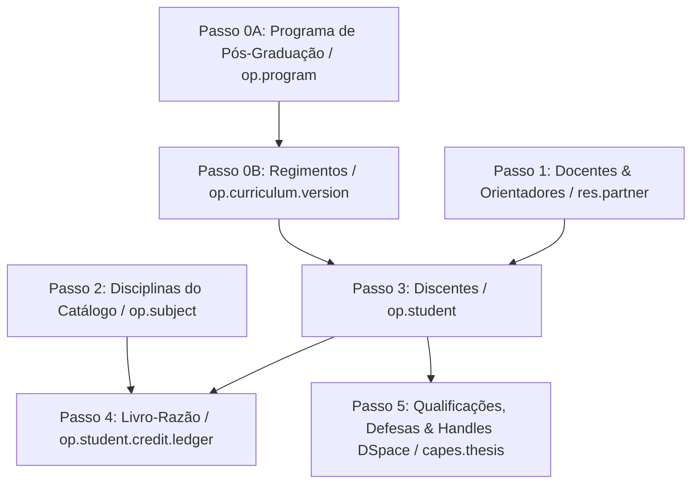

# Guia Mestre de Migração e Preparação do Sistema (`Legacy` $\rightarrow$ `Odoo CAPES`)

Este guia estabelece o **manual exaustivo de preparação, parametrização e importação de dados** para migrar o acervo histórico de um Programa de Pós-Graduação *Stricto Sensu* para o ecossistema `l10n_br_openeducat_capes`.

---

## 🏛️ 1. Entendendo o Conceito de Versionamento Regimental (Ato Jurídico Perfeito)

No Odoo `l10n_br_openeducat_capes`, o discente não é vinculado genericamente ao "Curso", mas sim a uma **Versão Regimental específica (`op.curriculum.version`)**.

### Por que isto é obrigatório na migração?
* **Ato Jurídico Perfeito (CF/88):** Um aluno que ingressou em 2023 sob o regimento de 24 créditos e 24 meses de prazo não pode ser afetado por alterações aprovadas pela CPG em 2025 (ex: aumento para 30 créditos).
* **Campos Relacionados:** Quando um discente é importado, ele exige o campo `curriculum_version_id/name`. Esse regimento armazena o número de créditos mínimos, a carga horária por crédito, o prazo de defesa, o quórum de banca e o momento de comprovação de proficiência em inglês.

---

## 🧹 2. Reiniciando a Base de Dados (Limpeza Total de Dados Demo)

Antes de iniciar a migração oficial, o ambiente deve estar 100% isento de dados fictícios (*Demo Data*):

1. Acesse: **[http://localhost:8069/web/database/manager](http://localhost:8069/web/database/manager)**
2. Exclua a base de testes antiga com o botão **Delete** (Informe a Master Password: `admin_capes_master_2026`).
3. Clique em **Create Database**:
   - **Database Name:** `mptrcs_ipen_prod`
   - **Email:** `admin@ipen.br`
   - **Password:** *Sua senha forte de administração*
   - **Language:** `Portuguese (BR)`
   - **Country:** `Brazil`
   - **Demo Data:** ⏹️ **DESMARCADO (UNCHECKED)**
4. Ao fazer o primeiro login, vá em *Configurações*, ative o **Modo Desenvolvedor**, vá em *Aplicativos*, clique em **Atualizar Lista de Aplicativos** e instale o módulo `l10n_br_openeducat_capes_diploma`.

---

## 📋 3. Sequência Rígida de Carga de Dados (Resolução de Chaves Estrangeiras)

A importação dos arquivos CSV **deve obrigatoriamente seguir os 7 passos abaixo**. Se um passo for invertido, o Odoo rejeitará o arquivo alegando que a chave estrangeira (*FK*) não foi encontrada.

---

## 📄 4. Análise Detalhada dos Arquivos CSV e Campos Obrigatórios

Todos os templates de importação pré-formatados estão disponíveis no diretório [`import_templates/`](file:///home/mario/progs/workspace_educat/l10n_br_openeducat_capes/import_templates).

### Passo 0A: Cadastro do Programa (`00_programa_program.csv`)
* **Modelo Odoo:** `op.program`
* **Tela Odoo:** Ensino CAPES $\rightarrow$ Configurações $\rightarrow$ Programas

| Campo CSV | Nome no Odoo | Obrigatório? | Tipo / Descrição | Exemplo |
| :--- | :--- | :---: | :--- | :--- |
| `name` | Nome do Programa | **SIM** | Text. Nome completo do PPG. | `Programa de Pós-Graduação em Tecnologia das Radiações` |
| `short_name` | Sigla do Programa | **SIM** | Char. Sigla oficial. | `MPTRCS` |
| `snpg_code` | Código SNPG CAPES | **SIM** | Char. Chave Mestra da CAPES (8+5 dígitos). | `33002010001P0` |
| `modality` | Modalidade CAPES | **SIM** | Selection: `academic` ou `professional`. | `professional` |
| `regime` | Regime Letivo | **SIM** | Selection: `semester` (Semestral). | `semester` |

---

### Passo 0B: Cadastro dos Regimentos (`00_regimentos_curriculum_version.csv`)
* **Modelo Odoo:** `op.curriculum.version`
* **Tela Odoo:** Ensino CAPES $\rightarrow$ Configurações $\rightarrow$ Versões Regimentais

| Campo CSV | Nome no Odoo | Obrigatório? | Tipo / Descrição | Exemplo |
| :--- | :--- | :---: | :--- | :--- |
| `name` | Nome da Versão Regimental | **SIM** | Char. Identificador único do regimento. | `Regimento MP-TRCS v2 (2024)` |
| `program_id/snpg_code` | Programa (Código CAPES) | **SIM** | FK para `op.program.capes`. Mapeado pelo código SNPG. | `33002010001P0` |
| `min_credits` | Créditos Totais Exigidos | **SIM** | Integer. Mínimo total exigido para titulação (ex: 100). | `100` |
| `min_subject_credits` | Créditos Mínimos em Disciplinas | **SIM** | Integer. Créditos mínimos em disciplinas presenciais do PPG. | `40` |
| `thesis_credits` | Créditos da Dissertação / Tese | **SIM** | Integer. Créditos atribuídos ao Trabalho Final. | `52` |
| `other_mandatory_credits` | Outras Atividades Obrigatórias | **SIM** | Integer. Créditos em Seminários Gerais / Estágios. | `8` |
| `credit_hour_ratio` | Fator Horas por Crédito | **SIM** | Integer. Carga horária equivalente a 1 crédito (ex: 15h). | `15` |
| `max_external_credits_percent` | Teto Créditos Externos (%) | **SIM** | Integer. Percentual máximo de disciplinas externas (ex: 50%). | `50` |
| `max_months_defense` | Prazo Máximo Titulação (meses) | **SIM** | Integer. Teto regimental em meses (ex: 24). | `24` |
| `max_days_post_defense_deposit` | Prazo Depósito Final (dias) | **SIM** | Integer. Dias pós-defesa para envio do PDF corrigido. | `30` |
| `proficiency_stage` | Exigência Proficiência | **SIM** | Selection: `admission`, `qualification`, `defense`. | `admission` |
| `teaching_internship_mode` | Regra Estágio Docência | **SIM** | Selection: `not_applicable`, `scholarship_only`, `mandatory_all`. | `not_applicable` |
| `ptt_validation_mode` | Modo Validação PTT | **SIM** | Selection: `cpg_checklist`, `qualis_prior`, `none`. | `cpg_checklist` |

---

### Passo 1: Cadastro de Docentes (`01_docentes_faculty.csv`)
* **Modelo Odoo:** `op.faculty` / `res.partner`
* **Tela Odoo:** OpenEduCat $\rightarrow$ Professores

| Campo CSV | Nome no Odoo | Obrigatório? | Tipo / Descrição | Exemplo |
| :--- | :--- | :---: | :--- | :--- |
| `name` | Nome Completo | **SIM** | Char. Nome do docente. | `Prof. Dr. Carlos Eduardo Silva` |
| `cpf` | CPF do Docente | **SIM** | Char. 11 dígitos numéricos (Chave de busca). | `12345678901` |
| `email` | E-mail Institucional | **SIM** | Char. E-mail oficial. | `carlos.silva@ipen.br` |
| `orcid` | Identificador ORCiD | **NÃO** | Char. PID biográfico (0000-0000-0000-0000). | `0000-0002-1825-0001` |
| `lattes_url` | URL do Lattes | **NÃO** | Char. Link do currículo Lattes. | `http://lattes.cnpq.br/1234567890123456` |
| `category` | Categoria de Vínculo | **SIM** | Selection: `permanent`, `collaborator`, `visitor`. | `permanent` |

---

### Passo 2: Catálogo de Disciplinas (`02_disciplinas_subjects.csv`)
* **Modelo Odoo:** `op.subject`
* **Tela Odoo:** OpenEduCat $\rightarrow$ Disciplinas

| Campo CSV | Nome no Odoo | Obrigatório? | Tipo / Descrição | Exemplo |
| :--- | :--- | :---: | :--- | :--- |
| `code` | Código da Disciplina | **SIM** | Char. Código interno do catálogo (Chave). | `TRC5701` |
| `name` | Nome da Disciplina | **SIM** | Char. Nome exato da matéria. | `Física das Radiações I` |
| `subject_type` | Obrigatoriedade | **SIM** | Selection: `compulsory` (Obrigatória), `elective` (Eletiva). | `compulsory` |
| `credits` | Número de Créditos | **SIM** | Integer. Créditos atribuídos. | `4` |
| `type` | Natureza da Carga | **SIM** | Selection: `theory` (Teórica), `practical` (Prática). | `theory` |

---

### Passo 3: Cadastro de Discentes (`03_discentes_students.csv`)
* **Modelo Odoo:** `op.student` / `res.partner`
* **Tela Odoo:** OpenEduCat $\rightarrow$ Alunos

| Campo CSV | Nome no Odoo | Obrigatório? | Tipo / Descrição | Exemplo |
| :--- | :--- | :---: | :--- | :--- |
| `gr_no` | Matrícula / Registro | **SIM** | Char. Número de registro acadêmico (Chave). | `2024001` |
| `name` | Nome Completo Aluno | **SIM** | Char. Nome civil. | `Ana Paula Oliveira` |
| `cpf` | CPF do Discente | **SIM** | Char. 11 dígitos numéricos. | `11122233344` |
| `email` | E-mail do Discente | **SIM** | Char. Contato eletrônico. | `ana.oliveira@ipen.br` |
| `orcid` | ORCiD do Discente | **NÃO** | Char. PID biográfico discente. | `0000-0002-1111-2222` |
| `admission_date` | Data de Ingresso | **SIM** | Date (AAAA-MM-DD). Data da primeira matrícula. | `2024-03-01` |
| `capes_status` | Status na CAPES | **SIM** | Selection: `regular` (Ativo), `graduated` (Titulado), `dismissed`. | `regular` |
| `curriculum_version_id/name` | Versão Regimental | **SIM** | FK pelo nome do regimento (Passo 0B). | `Regimento MPTRCS 2024` |
| `main_advisor_id/cpf` | CPF do Orientador | **SIM** | FK pelo CPF do docente (Passo 1). | `12345678901` |

---

### Passo 4: Livro-Razão / Histórico (`04_historico_livro_razao_ledger.csv`)
* **Modelo Odoo:** `op.student.credit.ledger`
* **Tela Odoo:** Ensino CAPES $\rightarrow$ Livro-Razão de Créditos

| Campo CSV | Nome no Odoo | Obrigatório? | Tipo / Descrição | Exemplo |
| :--- | :--- | :---: | :--- | :--- |
| `student_id/gr_no` | Matrícula do Aluno | **SIM** | FK pela matrícula do discente (Passo 3). | `2024001` |
| `subject_id/code` | Código da Disciplina | **SIM** | FK pelo código da disciplina (Passo 2). | `TRC5701` |
| `academic_period` | Período Letivo | **SIM** | Char. Semestre em que cursou. | `2024/1` |
| `grade` | Conceito / Nota | **SIM** | Char. Conceito oficial gravado em ata (A, B, C, 9.5). | `A` |
| `credits` | Créditos Obtidos | **SIM** | Integer. Créditos contabilizados. | `4` |
| `hours` | Carga Horária (h) | **SIM** | Integer. Horas presenciais cumpridas. | `60` |
| `is_approved` | Indicador Aprovação | **SIM** | Boolean: `TRUE` para aprovação, `FALSE` para reprovação. | `TRUE` |
| `completion_date` | Data Conclusão | **SIM** | Date (AAAA-MM-DD). Data de fechamento da pauta. | `2024-07-15` |

---

### Passo 5: Ritos, Defesas e Egressos (`05_trabalhos_defesas_thesis.csv`)
* **Modelo Odoo:** `capes.thesis`
* **Tela Odoo:** Ensino CAPES $\rightarrow$ Ritos e Bancas

| Campo CSV | Nome no Odoo | Obrigatório? | Tipo / Descrição | Exemplo |
| :--- | :--- | :---: | :--- | :--- |
| `student_id/gr_no` | Matrícula do Aluno | **SIM** | FK pela matrícula do aluno (Passo 3). | `2023015` |
| `stage` | Rito Acadêmico | **SIM** | Selection: `qualification`, `defense`, `seminar_area`. | `defense` |
| `doc_type` | Tipo de Documento | **SIM** | Selection: `dissertation`, `thesis`, `tech_product`. | `dissertation` |
| `title` | Título Final em Ata | **SIM** | Char. Título exato aprovado pela banca. | `Desenvolvimento de Radiofármaco...` |
| `defense_date` | Data e Hora Defesa | **SIM** | Datetime (AAAA-MM-DD HH:MM:SS). | `2025-06-20 14:00:00` |
| `status` | Situação do Rito | **SIM** | Selection: `approved`, `deposit_pending`, `homologated`. | `homologated` |
| `repository_url` | Handle DSpace | **NÃO** | Char. Link permanente do repositório (Egressos). | `http://repositorio.ipen.br/handle/...` |

---

## 🛠️ 5. Procedimento Prático de Importação no Odoo

Para cada arquivo CSV acima:

1. Acesse a tela correspondente no Odoo (ex: *Ensino CAPES $\rightarrow$ Configurações $\rightarrow$ Versões Regimentais*).
2. Clique no menu **Favoritos** (ícone de engrenagem no topo) $\rightarrow$ **Importar Registros**.
3. Clique em **Carregar Arquivo** e selecione o CSV correspondente.
4. O Odoo preencherá o mapa "De / Para". Verifique se a coluna `program_id/snpg_code` ou `curriculum_version_id/name` foi associada corretamente.
5. Clique no botão **Testar (Test)**:
   - Se aparecer uma caixa verde com a mensagem *"Tudo parece correto"*, clique em **Importar**.
   - Se aparecer uma caixa vermelha, o Odoo indicará exatamente a linha e a coluna com problema (ex: *CPF do orientador não encontrado*). Corrija o CSV e teste novamente.

---

## 📌 6. Checklist Final de Auditoria Pós-Migração

Após rodar a carga dos 7 passos:

1. ✅ **Conferência de Créditos:** Acesse um discente em *Alunos*, veja o extrato em *Livro-Razão de Créditos* e confirme se a soma bate com o histórico impresso antigo.
2. ✅ **Conferência de Regimento:** Verifique na aba *Informações Acadêmicas* do aluno se a *Versão Regimental Ativa* reflete o regimento correto de seu ano de ingresso.
3. ✅ **Teste do Manifesto DSpace e Diploma:** Em um discente egresso (`homologated`), verifique se o botão de impressão do *Histórico Escolar Consolidado* gera o PDF QWeb sem erros.
